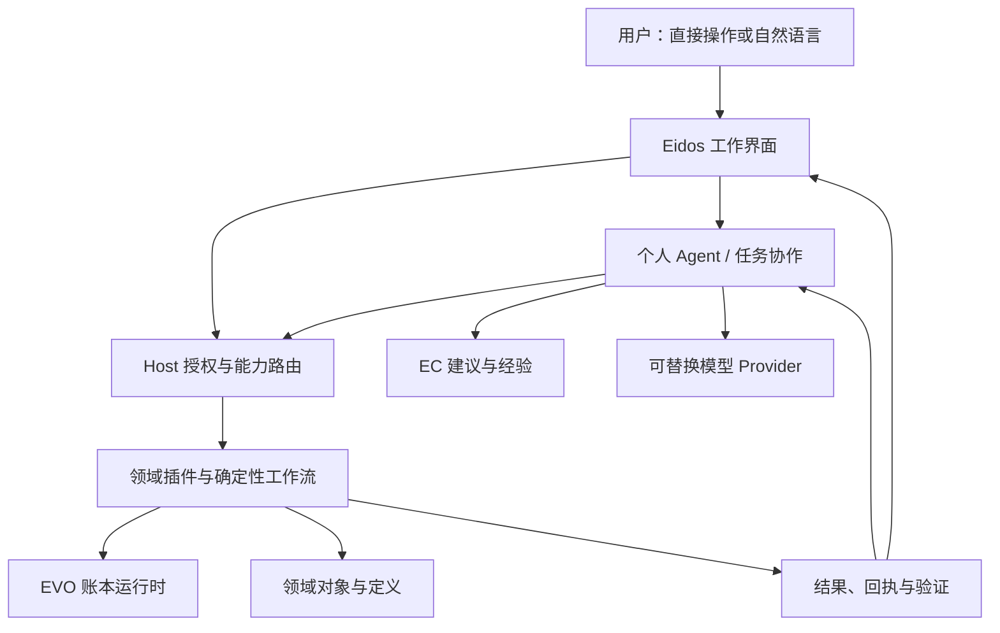

# EVO 企业个人 Agent 建设总纲与实施规范 v1.0

> Document class: HISTORICAL_SNAPSHOT — 2026-10-10 研究与建设提案交付快照。
> Status: PROPOSED / NOT IMPLEMENTED。收录不自动改变项目现行宪法、主线阶段或验收状态；后续采用通过 owner ADR 与实施记录落实。此快照保留，后续修订另行版本化。

**用途：下一阶段产品、架构、插件协议、交互与工程实施的完整规划。**

编制日期：2026-10-10（北京时间）。代码基线：本次读取固定到四个仓库的 commit，见第 2 章。状态：**供纳入项目的设计提案，不自动替代仓库现行宪法，不表示已经开发或上线**。作者已通过 GitHub 连接读取相关权威文档、公共契约、关键实现与近期提交；外部参考采用官方文档和原作者文章。未运行四仓库完整测试，未进行生产操作，未修改任何仓库或主线状态。

本文将“必须”用于本方案建议的验收要求，将“现有”仅用于有仓库依据的能力。现有方案与新增建议冲突时，先形成 ADR 和兼容计划，不以本文件直接覆盖现行规则。本文中新增接口名、状态、表结构均为候选设计，需要版本化接入，不能声称当前接口已支持。

## 独立 Agent 线执行边界（用户确认：2026-10-10）

本方案属于独立的 **Agent 线**，不是现有业务主线的下一阶段，也不接管 TR-01/TR-01B 或 2D 专项。

- 独立分支、PR、任务清单和验收记录；PA-00 至 PA-06 是 Agent 线自己的阶段。
- 不修改主线 `project.status.json`、生成的 `HANDOFF-LATEST.md` 或主线任务顺序；Agent 进展记录在专属文档中。
- 可以读取、复用主线已合入的公开能力，但不要求主线暂停或为 Agent 线改变推进顺序。
- 涉及共享契约、公共组件、数据库迁移或部署时，先核对并行改动及 owner，采用兼容、可隔离的变更；不能以独立分支为由假设不存在集成影响。
- 不直接推送 main，不把 Agent 线部署和主线发布绑定；需要集成时以明确范围的 PR 协调接入。
- 当前仅收录设计文档，不代表已经启动实现，也不改变任何主线验收结论。

## 阅读入口与目录

产品负责人先读 1–5、9–12、25–28 章；架构与开发负责人读 6–8、13–24 章；实施 Agent 先读 2、26–30 章，再按任务读取相关章节。不要把整份文档无差别放进每次模型请求。

1. [总体结论与成功标准](#1-总体结论与成功标准)
2. [四项目现状、证据与偏差](#2-四项目最新现状证据与偏差)
3. [产品定位与边界](#3-产品定位与边界)
4. [消除逐项补功能的机制](#4-如何减少一个功能一个功能补)
5. [确定性与 LLM 的分工](#5-确定性功能与-llm-分工)
6. [总体架构与所有权](#6-总体架构与所有权)
7. [统一任务入口和插件协作协议](#7-平台与个人-agent-的统一协作契约)
8. [Capability、工具、配方与验证](#8-能力目录任务模板与确定性操作)
9. [全平台 AI 入口规划](#9-各类平台页面如何与个人-agent-互动)
10. [聊天工作区信息架构](#10-个人-agent-的产品信息架构)
11. [按钮、消息与状态详细规范](#11-ui-与交互细则包含按钮复制和完整状态)
12. [导入、采购查询、2D 与跨应用场景](#12-首批场景与边界案例)
13. [Task / Run / Step 与恢复](#13-task--run-的持久执行与恢复)
14. [数据模型与存储](#14-存储迁移附件与数据生命周期)
15. [上下文、长期会话和记忆](#15-context个人记忆与企业知识)
16. [EC 经验学习与能力固化](#16-ec-学习闭环与经验产品化)
17. [模型 Provider 与推理调度](#17-模型与-provider-可替换性)
18. [事件、流式响应与结果协议](#18-协议事件流与外部互操作)
19. [权限、审批与企业安全](#19-权限审批与企业安全)
20. [多租户、组织与离职交接](#20-多租户组织和人员交接)
21. [插件接入与认证](#21-插件-sdk接入流程与认证)
22. [评测与验收矩阵](#22-评测体系与验收矩阵)
23. [性能、容量、成本与可观测性](#23-性能容量成本与可观测性)
24. [故障、运维、备份与升级](#24-运维降级备份与升级)
25. [远期演进及禁止提前建设的内容](#25-长期演进现在建设什么保留什么)
26. [开发包、依赖顺序与交付门槛](#26-开发包依赖顺序与交付门槛)
27. [详细需求与责任矩阵](#27-详细需求与责任矩阵)
28. [决策记录、待定事项与风险](#28-决策记录待定项与风险)
29. [下一开发窗口交接要求](#29-下一开发窗口交接要求)
30. [资料来源与证据索引](#30-资料来源与证据索引)

---

## 1. 总体结论与成功标准

### 1.1 要建设什么

建设一个以人为中心、能在授权范围内处理企业工作的个人 Agent。它不仅能回答问题，还能理解当前工作对象、提出方案、调用已有能力、跟踪任务、验证结果并积累受治理的经验。人通过直接操作和自然语言两种方式使用同一套企业能力。

**核心不是把聊天窗口做得功能很多，而是使平台具备统一的任务、能力、状态、证据和交互基础。**

用户不应反复要求“这里加复制”“那里加停止”“那个页面增加自动匹配”。这些应由组件标准、任务状态机、插件贡献协议和认证测试产生。新业务能力仍然需要设计其业务语义；架构不能免除未知业务的开发，但应免除每次重复搭建通用基础。

### 1.2 推荐总体路线

保留四项目边界，以现有 Personal Agent、Capability Fabric、ActionHost、Eidos Chat v0.2、PostgreSQL Conversation 和 EC 导入经验闭环为基础，形成：

**企业工作入口 → 明确任务 → 受权能力 → 确定性执行 → 可验证结果 → 受治理经验。**

采用“单一主 Agent＋确定性工作流＋按需专业能力”的默认模式。暂不把企业建成一群互相聊天的自治 Agent。未来可接专家 Agent，但它们只是有界委派对象，不是新的权限或数据权威。

### 1.3 衡量成功

| 维度 | 要达到的结果 | 不应使用的替代指标 |
|---|---|---|
| 用户完成工作 | 少找信息、少重复输入、少跨页交接，结果可用 | 聊天消息更多 |
| 能力可扩展 | 新插件声明契约即可进入直接操作与 Agent 的统一体系 | 每次修改主 Agent prompt |
| 企业可信 | 数据来源、权限、实际变更、失败与未完成可解释 | 模型语气很自信 |
| 长期连续性 | 刷新、超时、换模型、换进程后仍知道任务状态 | 聊天窗口没有关闭 |
| 维护性 | 相同交互只修一次，插件不复制基础组件 | 单个页面看起来可用 |
| 智能进步 | 经过评估的经验提高后续任务质量 | 无差别保存更多聊天 |
| 运行独立性 | LLM/EC 停机时，固定业务功能仍可使用 | 所有操作都依赖 Agent |

### 1.4 第一阶段必须形成的产品体验

在导入页点击“AI 自动匹配”，立即看见任务已接收；Agent 不再要求用户复制文件信息；可以返回原页面继续工作；建议以映射差异呈现；人可以修改、预检、提交；重复点击不重复创建任务；断网不丢进度；停止后明确哪些已做、哪些未做；相同结构再次导入优先使用已确认 Recipe。换成 Item 或 Warehouse 后不重写这套聊天与任务基础。

---

## 2. 四项目最新现状、证据与偏差

### 2.1 本次固定研究基线

以下为交付前复核的 `main` 快照。平台关键代码初读基线为 `592a57298ecc17dbe616ed887620ae31e65b49ec`，随后复核到下表新提交并更新阶段判断；其他三仓未变。存在并行开发，下一窗口仍必须刷新基线。

| 项目 | 固定 commit | 提交时间（北京时间） | 当前可证实重点 |
|---|---|---|---|
| EVO-App-Platform | `f7bc5eb88208d7eef0f11abf3a6eae4b9783ed9d` | 10-10 09:18:19 | #567 已合入；#569 按安装后真实浏览器证据关闭限定 TR-01A 技术参考 gate，TR-01B 待有界设计 |
| EVO | `2311022640aa108a6baf3db44d9b26bd3e3ad623` | 10-10 07:53:40 | #105 合入不可变采购收货冲销语义及重放认证 |
| Eidos | `df6b09c8b21f15bdd5b96c4983a54f21f49e7ccb` | 10-09 12:51:45 | #129 合入 Personal Agent Workbench chrome 与图标语义 |
| Experience-Compiler | `2ce89420643a9f08e60301fa6d9424705ef70c1e` | 10-08 16:16:52 | #8 SQLite 跨 API worker 线程访问修复；此前 #7 为导入经验学习 |

证据层级：**实现存在、测试代码存在、CI 结果、生产部署、人体验收是五件事**。本次的历史生产 PASS 来自状态文件与验收记录，未独立登录生产复验；不能据此把刚合入的 #565 直接宣布为完整生产体验 PASS。

### 2.2 EVO-App-Platform

已读取的权威状态指出当前主线是 **TR-01 Trading Reference Loop**，而不是 README 中仍出现的 P1.4X。往来对象之后已经推进了 Item、Warehouse/Location，并进入真实采购参考链。不能根据旧聊天继续建议“下一步先开发 Item”。

关键进展：

- CP-03D：导入映射、Recipe 复用与 EC 学习闭环，记录为 `CLOSED_HUMAN_PASS`。
- AF-01：Conversation 从 JSONL 迁移到 PostgreSQL，记录为 `CLOSED_PRODUCTION_PASS`。
- AF-02：原文保留、版本化摘要/检查点、受限上下文组装，记录为 `CLOSED_PRODUCTION_PASS`。
- CP-05/06/07：对象分面、责任/投影、可选 BI Workbench 等已经继续推进；旧局部路线中的 `CP-05 ACTIVE` 是历史残留，不代表整体还停在此处。
- IT-01 与 WH-01：状态记录已有真实数据验证和跨对象基础契约复用证据。
- TR-01A1/A2：正向采购收货、完整收货冲销与确定性重放参考链已闭合其经济证明范围。
- #562/#564/#565：同一受权采购 READ 服务逐步接入 Agent 能力、Eidos 页面和 Workbench。#565 当时文档明确验收尚待完成；这一历史状态已由下述 #567/#569 更新。

交付前复核：**#567 已合入，#569 已更新权威状态。**安装后 Chrome/Eidos、独立 AI Principal Action Host、Workbench 与真实 EVO PostgreSQL 的限定参考闭环，记录为 `REFERENCE_ACCEPTED_INSTALLED_CI_PRODUCTION_CODE_PASS`；TR-01B 状态为 `READY_FOR_BOUNDED_DESIGN_NOT_STARTED`。CI 38012256000 记录通过，代码部署记录成功。本次读取了该证据文档，未自行重跑。

这一结果证明一单范围的隔离授权、真实浏览器路径、Human/AI 身份的同操作结果及越权拒绝；**不证明客户生产登录、个人 Agent 的自然语言/LLM 推理、广义采购业务或部分/多次冲销。**基础对象与采购链应作为现有成果接入，不因 Agent 规划重新展开已关闭工程。

### 2.3 EVO

EVO 的职责是确定性业务运行时，不应承接聊天、Provider 选择、个人记忆或任务编排。当前工程新增证据包括 `REVERSES` 关系、追加收货冲销事实、Work/库存/应付影响及全量重放验证。

其 `project.status.json` 仍标注 2026-09-24 的 CORE-MIN-02 指针，而当前 main 已前进到 10-10；这是进度文档漂移。**不能把旧状态当作最新实现边界，也不能把某一参考链的认证扩大为全部财务业务成熟。**

Agent 必须经业务插件与 Host 授权调用 EVO 公共接口，不直接构造数据库写入；库存余额和 Work 应通过权威读模型读取。Agent 的任务日志重建也不是 EVO 的业务重记账，两种“重放”需要严格分开。

### 2.4 Eidos

已具备 Chat v0.2 的结构化消息部件：text、notice、activity、evidence、proposal；有 readiness、上下文选择、建议提问、语义图标、Workbench shell 和设计 token。现有资源值得扩展，不应新建一套 Personal Agent 私有组件库。

Eidos 最新 main 已包含个人 Agent 顶部样式/图标改善。但商业化 2D 的几何、框选、手工折线、吸附、写令牌等工作仍存在于 #130–#140 等开放 PR，部分为 Draft。App Platform 也有对应集成候选。**这些不能按已上线能力依赖。**

特别要协调正在做的投影 CAS/write token：Agent 对图形的修改必须接入同一并发保护，不能另一条写入通道绕过人的未保存草稿。

### 2.5 Experience-Compiler

EC 的长期定位包括持久知识、证据、学习方法、上下文编译、研究、诊断、建议与经验积累。当前与平台最明确的真实集成是导入字段经验：人确认、预检通过、提交成功后形成企业/对象范围内经验；不同文件结构可得到带来源的建议。

EC 的 README 与架构材料同时包含参考实现、长期方向及部署指南。比如 `AdaptiveContextCompiler` 的预算使用估算，部分研究/元学习说明仅为简短方向。**已有模块名或长期路线不等于完整企业级生产实现。**

当前不能宣称已有跨行业自学习、自动全局推广或成熟的任意长期任务规划。SQLite 线程修复解决的是特定服务并发问题，也不等于多实例知识平台已经验证。

### 2.6 面向本次规划的差距表

| 能力 | 本次观察 | 下一阶段处理 |
|---|---|---|
| 持久会话 | PostgreSQL authority 已有并有迁移/生产记录 | 保留并扩展，不重新迁移一遍 |
| 长上下文 | 有源范围、策略版本、检查点和字符预算实现 | 增加全请求 token 预算、重要性检索及质量评测 |
| Run 恢复 | 有 start/get/resume、切片、事件、Receipt 防重 | 补服务端调度、数据库租约与跨实例保护 |
| Run 存储 | 读取的实现仍包含 file-backed 事件存储 | 有界迁移到 PostgreSQL；部署实际绑定需盘点 |
| 取消 | 有 CANCELLED 类型；读取的动作只有 start/resume/get/list | 新增正式取消契约与 worker 协作，不把浏览器中断当取消 |
| 重复提交 | 有 clientTurnId、原 Run 复用、进程内 single-flight | 数据库唯一键、原子创建与 worker fencing |
| WRITE 回执 | 有 REQUESTED/SUCCEEDED/FAILED/DENIED；不确定写入会阻断 | 明确 UNKNOWN/对账流程及领域幂等，不能自动重试 |
| 工具发现 | Capability Fabric 已有 search/describe/invoke | 延续动态发现；v0.1 READ/PLAN，不擅自开放 WRITE |
| 页面→Agent | 导入页已有 `type: agent` 和任务上下文 | 版本化为统一协助请求与结果回写协议 |
| 消息 UI | 结构化消息已有；具体控件仍跨 renderer/Host | 统一 Eidos 行为原型、状态投影与交互认证 |
| Recipe 与 EC | 同结构确定性复用与跨结构建议已有分工 | 推广到多对象，增加失效、反例与证据治理 |
| 流式/附件/后台任务 | 本次关键链未证明完整端到端闭环 | 标为待实现或待验，不根据页面占位推断 |

---

## 3. 产品定位与边界

### 3.1 一个个人 Agent，多种工作上下文

沿用 Person-first 方向。每个人拥有可持续的个人协作入口；在个人上下文和明确授权的企业上下文中工作。“企业 Agent”在本文指具备企业能力与治理的个人 Agent，不额外创造全能企业人格。

可以有采购分析、导入辅助、经营诊断等专业任务模式，但模式不创建一套重复用户身份、聊天数据库或权限。模型、执行 worker、页面可以替换，个人身份、任务和证据保持稳定。

### 3.2 必须区分的对象

| 对象 | 意义 | 不能当作什么 |
|---|---|---|
| Conversation / Thread | 人可见的交流记录 | 业务事务或长期记忆 |
| Task | 用户希望达成的目标及验收条件 | 一条模型请求 |
| Run | 为 Task 发起的一次执行尝试 | 整段永远运行的会话 |
| Step | 一个可记录、可恢复的工作步骤 | 隐藏推理链 |
| Capability Operation | 所属插件声明的语义能力 | 页面上的一个按钮 |
| Action Receipt | 调用与实际效果的凭据 | 聊天中“已完成”几个字 |
| Proposal | 尚未生效的建议或变更方案 | 已提交业务事实 |
| Work | 领域系统派生/管理的待办 | Agent 的模型循环状态 |
| Personal Memory | 受治理的个人长期偏好与经验 | 全部聊天的复制品 |
| EC Experience | 企业/行业范围内的受治理经验 | 当前库存或应付余额 |

### 3.3 主要用户与场景

一线员工需要快速完成本职任务；主管需要处理异常与协调；实施人员需要导入和配置；管理层需要有依据的解释与推演；管理员需要授权、费用、质量与故障治理。不能用一个技术诊断面板作为所有人的首页。

Agent 可以解释“为什么有待收货任务”，可以建议下一步，但“完成收货”“批准付款”“发布规则”必须调用正式业务操作并按权限/策略执行。个人 Agent 不替用户获得未授予的角色，也不自动成为付款审批人。

---

## 4. 如何减少一个功能一个功能补

### 4.1 采用五个稳定扩展点

1. **能力契约**：业务语义、输入输出、权限、作用域、效果和验证写一次。
2. **任务入口声明**：页面对象、用户目标、允许动作和结果落点写一次。
3. **结果部件**：表格、证据、差异、建议、表单、任务进度采用 Eidos 的注册部件。
4. **执行协议**：接收、调度、取消、恢复、重试、回执统一处理。
5. **认证规则**：未实现空态、异常、权限拒绝、恢复和移动端行为的贡献不能进入正式发布。

新插件只为自己的业务提供适配；不为每个插件重写复制按钮、聊天状态、长连接或重试策略。

### 4.2 能自动生成什么

从同一语义元数据编译：表单字段、基本校验、工具说明、操作目录、只读/必填标记、标准错误映射、基础测试模板、帮助文档、任务入口和可访问性标签。

不能仅靠 JSON Schema 自动理解：业务正确性、审批职责、跨对象一致性、经济冲销、复杂数据迁移和真实验收预言机。这些必须由领域 owner 提供。

### 4.3 不要从 prompt 维护业务规则

添加能力的正常路径应为：定义/扩展所属插件 → 注册 Capability → 通过认证 → Host 根据安装与权限发现 → 直接界面和 Agent 均可使用。

反模式：修改主 Agent 的大段 prompt → 写页面专用 if/else → 模拟点击按钮 → 从聊天文字猜是否成功。它既不可靠，也不能长期扩展。

### 4.4 每个新功能的统一完成定义

必须同时声明：用户目标、所在对象、前置状态、直接入口、Agent 角色、输入/输出、权限、执行效果、幂等、进度、错误恢复、完成验证、结果回到哪里、日志与隐私、语言和移动端、测试及回滚。

只实现正常成功路径，不算完成。不能把这些要求全部交给用户逐次发现。

---

## 5. 确定性功能与 LLM 分工

| 工作 | 默认执行者 | Agent 能做什么 | 固定界面必须保留 |
|---|---|---|---|
| 新建、保存、过滤、导出、归档 | 确定性插件 | 根据用户意图调用 | 是 |
| 自动排版、对齐、吸附 | 确定性算法/Eidos 能力 | 选择已声明布局选项 | 是 |
| CSV/XLSX 解析、类型校验、写入 | Data Import + 对象插件 | 解释错误、建议修复 | 是 |
| 已知结构字段映射 | 已确认 Recipe | 解释复用依据 | 是 |
| 未知字段语义理解 | LLM + EC 建议 | 提供候选、理由、澄清问题 | 人工修改与预检 |
| 业务金额、数量、余额与重算 | EVO / 领域服务 | 查询和解释 | 权威查询入口 |
| 异常原因分析 | LLM/EC + 事实查询 | 假设、查证、比较 | 可追溯证据 |
| 任务执行/重试/超时/幂等 | 任务运行时 | 决定下一项有界工作 | 状态与恢复入口 |
| 权限、租户过滤、审批要求 | Host/授权 Provider | 请求合法授权或解释限制 | 管理与审批入口 |
| 记忆和经验晋升 | 治理流程 | 提议、证据整理 | 审核/撤销/查看来源 |
| 外发消息/采购/付款 | 业务插件＋授权政策 | 准备草稿、按政策执行 | 明确预览和效果范围 |

建议四种任务模式：`DIRECT`（无模型）、`ASSISTED`（有界建议）、`WORKFLOW`（已知步骤）、`AGENTIC`（探索式多步）。这是新增描述维度，不是直接增加现行 Package.type 枚举。

不要让 LLM 决定权限，也不要让它用自然语言自己计算本应由账本提供的余额。另一方面，不要为每种用户措辞硬编码路由；用户目标理解、模糊匹配和跨领域解释可以发挥模型优势。

---

## 6. 总体架构与所有权



### 6.1 责任分配

| 模块 | owner | 关键约束 |
|---|---|---|
| Chat renderer、消息动作、抽屉、移动端、图标 | Eidos | 不知道供应商/订单私有结构 |
| Agent 产品、任务策略、用户协作 | App Platform 的 Personal Agent 包 | 不绕过 Host，不硬绑模型 |
| 通用执行租约、事件序号、回执基础 | 平台受治理通用服务 | 只容纳跨插件必要机制 |
| 数据库/队列/对象存储具体实现 | 可替换 Provider/adapter | 不把部署特性变为业务语义 |
| 能力目录、生命周期、授权与路由 | App Platform Host | 小而稳定，按安装/使用懒加载 |
| 业务工作流和实际提交 | 对应领域插件 | 与直接 UI 共用服务 |
| 个人会话、任务状态、个人记忆 | 各自 App Platform 语义 owner | 分开 schema/接口/保留策略 |
| 企业定义与基础对象资源 | Enterprise Context＋所属对象插件 | 不是通用 AI 记忆桶 |
| 企业经验、研究、知识与方法 | EC | 提议不等于发布生效 |
| 账本、余额、派生 Work 与重算 | EVO 公共运行时 | 不接管 Agent 生命周期 |
| BI 首页与个人布局 | 可选 BI Workbench 插件 | 无此插件时 Agent 仍可使用 |

### 6.2 可替换接口，而非提前微服务化

先建立进程内明确模块与公开端口，只有隔离、规模或部署证据要求时再拆服务。首阶段推荐：现有 Host API＋独立可恢复 worker＋PostgreSQL；EC 维持独立服务；对象存储用于大附件。并非每个模块都要独立容器。

任务编排、Conversation 查询、Context Assembly、工具网关、模型 Provider、EC Client、事件投影互相通过契约调用。数据库共用不意味着可以跨 owner 直接查私表。Agent 不读取 Provider 密钥；模型切换不改变任务 ID、消息 ID 或业务事实。

### 6.3 新增代码位置建议

沿现有目录推进：`contracts/` 放版本化公共语义；`agents/enterprise-agent/` 放 Agent 产品与编排；`manager/` 仅保留通用治理/已有兼容入口；`providers/` 放存储、调度、模型实现；`apps/data-import/` 等放业务任务适配；Eidos `src/chat/`、`src/workbench/` 放通用交互；EC `src/ec/learning/` 等承接学习。

不得因历史上某功能在 `manager/`，就把所有新 Agent 业务继续加进去。兼容名称 `enterprise-agent` 暂保留，用公开能力 `agent.personal` 表达产品，避免无收益大范围改名。

## 7. 平台与个人 Agent 的统一协作契约

本章所有新字段、路径和版本号均是**待实现的候选规范**，不是当前已发布 API。先与已有 contracts 合并评审，再形成正式 schema；不得直接按本文另造不兼容体系。

### 7.1 一个入口，多种任务，不必每次打开完整聊天

现有导入入口已经使用 `type: "agent"`、`agentCapability: "agent.personal"`、`context.taskKind: "data-import.mapping"` 和 `refreshSourceOnComplete: true`。保留兼容层，把它映射为统一 AssistanceRequest。其他插件通过同一入口声明任务，不自行拼接隐藏系统提示词、绕过 Host 调模型。

建议请求形态：

```json
{
  "schemaVersion": "assistance.request/1",
  "requestId": "client-generated-uuid",
  "taskKind": "data-import.mapping",
  "presentation": "side-panel",
  "source": {
    "pluginId": "data-import",
    "viewId": "mapping",
    "resourceRef": "import-job:123",
    "resourceRevision": "17"
  },
  "contextRefs": ["import-job:123", "import-target:Item"],
  "userIntent": "建议字段映射，并说明不能确定的字段",
  "requestedOutcomes": ["mapping-proposal"],
  "locale": "zh-CN"
}
```

身份、企业、权限、许可的最大作用范围由服务端会话推导。`requestedOutcomes` 只是请求，不能授予权限；客户端传来的企业 ID、资源引用和版本都需验证。敏感原始行不应为了方便直接塞进 UI action；先传引用，再由受控读取能力按需取得脱敏样本。内部引用和所有示例 ID 均为示意。

处理顺序必须固定：认证 → 当前企业/主体绑定 → 插件启用与能力解析 → 资源授权 → 请求去重 → 创建/绑定任务与会话 → 记录用户可见意图 → 返回任务句柄 → 异步执行。响应不能等 LLM 完成才给用户反馈。

同一 `requestId` 的重试返回同一任务；同键不同请求摘要返回冲突。去重边界至少包含主体、企业、入口和规范化请求摘要，不能在跨租户范围返回已存在任务。请求初始回执和业务执行回执是两种对象。

### 7.2 返回的是结构化结果，不是要求页面读懂一段话

```json
{
  "schemaVersion": "assistance.result/1",
  "taskId": "task-123",
  "runId": "run-456",
  "outcome": "proposal-ready",
  "source": {"resourceRef": "import-job:123", "baseRevision": "17"},
  "artifacts": [{"kind": "mapping-proposal", "ref": "proposal:789"}],
  "effects": [],
  "nextActions": [{"command": "import.mapping.review", "proposalRef": "proposal:789"}]
}
```

`proposal-ready` 不是已保存，更不是已导入。采用建议后的 result 才能包含已完成 effect 的 receipt 引用、新资源版本和验证状态。前端不得从“已处理完成”的自然语言推断写入成功。没有读取权限的资源不暴露标题、摘要或深链接；卡片上的 command 仍由服务端重新鉴权。

页面回流规则：仅刷新匹配的 resource；有未保存编辑时显示“已有新结果，查看/合并”，不得直接覆盖；资源版本变更时重新比较或重建提案；用户已切换企业时不自动跳回原企业；页面关闭不等于取消任务。刷新事件只携带必要 ID 与版本，不广播数据正文。

### 7.3 双向桥接与状态闭环

平台负责发起请求、权限上下文、任务查询/订阅、回流导航与资源刷新。Agent 负责意图解释、显式计划、受控调用与结果说明。业务插件负责语义 schema、确定性执行和校验。Eidos 负责统一展示。

候选接口按语义提供：`requestAssistance`、`getTask`、`subscribeTaskEvents`、`submitTaskInput`、`reviewProposal`、`cancelTask`、`openSource`。HTTP 路径由现有路由规范确定，不强制全文示例成为正式 URL。所有请求具有版本、稳定 ID、关联追踪 ID、规范化错误结构。不能增加任意 JS 回调、模型生成 URL 跳转或“任意执行代码”字段作为通用扩展口。

## 8. 能力目录、任务模板与确定性操作

### 8.1 能力是业务语义，不是数据库万能工具

每个插件发布可机器读取、可人工审查的能力描述。最小信息：稳定 capability/operation ID、owner、版本、名称与适用场景、输入/输出 JSON Schema、权限需求、effect 类别、作用域约束、前置条件、错误类型、幂等支持、确认策略、执行耗时/成本提示、结果回读方式、审计要求、兼容版本。

现有代码已包含 READ/WRITE 等语义。扩展时必须尊重已有枚举；本文的“计划/执行/校验”可先是工作流阶段，不能未经迁移就新增 runtime 无法理解的 effect 值。

推荐能力边界示例：`import.inspect`、`import.proposeMapping`、`import.validateMapping`、`import.applyMapping`、`import.dryRun`、`import.commit`。反例：`execute_sql(sql)`、`update_any_object(json)`、`do_business(prompt)`。固定规则、权限和业务不变量不由模型重写。

服务端先按授权范围筛选目录，再让模型检索相关能力；不要把整个企业所有工具暴露给模型后才依赖拒绝执行。能力说明需要正反例，但不得夹带可覆盖系统治理规则的指令。工具输出属于数据，不自动升级为新工具定义。

### 8.2 Task Template 是把成功做法沉淀成稳定生产力

模板包含 taskKind、适用条件、所需能力版本、显式输入、执行步骤图、可选模型节点、校验器、确认点、失败恢复点、结果展示类型和验收样例。它不是长 prompt，也不是任意脚本。首批模板只做已存在场景：导入映射、导入错误解释、业务对象检索与摘要、已认证交易流程的辅助操作。

模型生成的计划必须通过 schema、权限、依赖与 effect 检查，才可成为可执行计划。高频重复任务优先固化为模板；新领域未稳定前保持建议模式。模板版本绑定运行，不能升级后在运行中途偷偷替换步骤。

### 8.3 无须为每个功能补一遍 Agent 接口的机制

插件一旦提供对象 schema、operation 描述、校验器、引用导航和标准结果，通用检索、表单辅助、解释、提案、执行进度就能够复用。新增业务不修改 Agent 核心判断分支；新增业务效果仍必须由业务 owner 实现和测试。这是减少重复开发，不是消除领域工程。

能力缺失时，返回“当前可查询，但没有获批的修改能力”等可行动说明，允许形成需求草稿；禁止模型临时猜 API、抓取管理员页面绕过权限，或把生成代码直接装到生产插件中。

## 9. 各类平台页面如何与个人 Agent 互动

| 页面/触点 | 默认确定性操作 | Agent 辅助 | 必须回到原页面的结果 |
|---|---|---|---|
| 列表 | 筛选、排序、分页、选择、导出 | 自然语言生成可见筛选条件、解释异常 | 可检查的过滤表达式，确认后应用 |
| 详情 | 查看、编辑、历史、关联跳转 | 总结已授权资料、解释状态 | 带证据的摘要和引用，不改原记录 |
| 编辑表单 | schema 驱动控件、校验、保存 | 草拟字段、解释字段、补全建议 | 字段级差异、采用/拒绝、再校验 |
| 导入工作台 | 上传、映射、预检、提交 | 自动匹配、错误归因、修复建议 | 映射提案、冲突、预检变化 |
| 采购/交易 | 认证过的命令与回执 | 帮助选择对象、草拟计划、解释影响 | 可核对单据/影响，明确确认点 |
| 审批 | 规则路由、批准/拒绝、职责分离 | 汇总证据、标注缺项 | 审批材料；模型不替人签署 |
| BI/图表 | 指标口径、查询、权限过滤 | 解释趋势、生成受约束分析方案 | 固定数据版本/时间范围与可重跑查询 |
| 2D/图形 | 选择、对齐、撤销、保存 | 提议布局、解释模型 | 可预览差异、版本检查后应用 |
| 设置 | 显式配置、测试连接 | 解释影响、诊断配置 | 可审查配置差异，密钥不入聊天 |
| 任务中心 | 搜索、继续、取消、查看回执 | 总结下一步、聚合阻塞原因 | 原任务、原版本、原责任人 |

同一个问题尽量在当前业务上下文解决。简单补全用行内建议；多步辅助用侧栏；跨页面任务用完整工作区；耗时批处理用后台任务。选择 presentation 不改变授权或执行协议。不要所有按钮都变成“去聊天问一句”。

## 10. 个人 Agent 的产品信息架构

### 10.1 推荐结构

顶部展示当前个人身份、企业上下文、会话标题、任务状态与必要菜单。主区域展示消息、提案、证据和结果；输入区负责意图与附件；侧边历史可折叠，支持搜索和状态筛选。复杂工作使用独立任务详情查看步骤、输入、回执、产物和恢复操作，不在聊天中堆砌日志。

保留现有 Eidos workbench 与 Agent workspace shell。桌面侧栏默认沿用 336px token，可在 240–720px 范围调整；主聊天阅读宽度建议 720–880px，作为可测试布局值而非新增全局 token。工具详情展开后允许更宽，不强迫大表格挤进气泡。

### 10.2 上下文必须看得见

当前企业、操作对象和来源任务用紧凑标签呈现；涉及写操作时在提案中再次列明。切换企业默认开始新上下文，不把旧企业历史正文自动送进新请求。同一线程如保留跨上下文阅读，需要明确分段和授权过滤；更简单的首期方案是一个线程绑定一个企业上下文。

长任务绑定启动时主体/企业与授权依据；后来权限收回时必须阻止下一步，不以“启动时有权限”为长期通行证。个人偏好可跨合法场景复用，但企业内部文档、价格、对象数据不能随个人身份自动跨企业流动。

### 10.3 历史和任务不是同一列表

会话历史回答“我聊过什么”，任务中心回答“什么正在执行、等我处理、已失败或已完成”。一个会话可产生多任务；一个任务可有恢复后的多个 Run；不能用最近一条聊天气泡代表全部任务状态。首期 UI 可共用容器，但底层对象关系必须分清。

移动端小于现有 700px breakpoint 使用全屏或底部面板；输入框不被软键盘遮挡，关键确认保持可见。中等屏幕沿现有 1024px 断点折叠辅助区域。响应式规则由 Eidos 统一发布，插件不各自猜断点。

## 11. UI 与交互细则：包含按钮、复制和完整状态

### 11.1 沿用已有设计资产

| 项目 | 当前可复用基线 | 本阶段要求 |
|---|---|---|
| 间距 | 2/4/6/8/12/16/20/24/32/40/48 | 使用 token；无必要不加独立数值 |
| 控件高度 | compact 32、normal 36、touch 44 | 桌面密集工具栏可 compact，触屏命中区至少 44px |
| 圆角 | 6/8/10/12/16 | 按控件级别统一，禁止每插件自创 |
| 字号 | meta12、compact13、body14、section16、page24 | 使用 rem 与可缩放根字号；正文不靠极浅灰 |
| 图标 | 24画布、2描边；16/20/24尺寸 | 使用 Eidos icon 系统；无 emoji 当产品按钮 |
| 主色/危险 | #2B6CB0 / #B42318 | 同一作用域一个主要行动；危险动作有语义文本 |
| 表面 | canvas #F5F7FA，白色内容面，hover #EEF3F8 | 用层次组织信息，不增加炫光和复杂装饰 |

这些颜色来自当前 token，但不等于任意组合天然满足对比度。所有实际文字/背景、disabled、focus 和错误状态都需检查；小字号的 subtle 文本不能作为唯一关键信息。44px 是项目触屏政策，WCAG 2.2 AA 的 target-size-minimum 24 CSS px 及其例外不能被混为同一要求。[S11]

### 11.2 按钮规范

按钮变体统一 primary、secondary、ghost、danger，与现有 Eidos 名称对齐实现；同一表单/提案只保留一个明显主动作。标签用动作动词：“采用映射”“开始预检”“提交导入”，不要多个含义不同的“确定”。有不可逆后果的按钮显示作用对象和范围。

状态包括默认、hover、pressed、focus-visible、disabled、loading、success、error。loading 必须有文字说明或可访问名称；阻止重复提交但不能锁死整个页面。disabled 对应原因应在附近或可访问描述中提供，不能只有鼠标悬浮才能知道。键盘焦点使用明确轮廓，不用颜色变化代替。

图标按钮必须有 accessible name 和 tooltip；tooltip 不替代可访问名称。图标可以是 16/20px，命中区仍按控件级别保留。多个相邻按钮有足够间距；移动端不要求精准点中小图标。更多菜单容纳低频动作，不能藏起当前任务唯一恢复入口。

### 11.3 复制按钮的明确行为

1. 消息级“复制”默认复制可读纯文本，保留自然段和列表；Markdown 源文通过更多菜单的明确选项提供。不要把活动状态、隐藏元数据、按钮标签一起复制。
2. 代码块复制精确代码内容，保留换行和缩进，不包含围栏、语言名、行号。表格提供“复制表格”为 TSV；普通消息复制表格时使用可读格式。不同语义用不同名称，不让一个图标随机复制不同内容。
3. 点击后等待 Clipboard API 成功才显示“已复制”和勾选图标，建议 2 秒后复原。失败显示“复制失败，请重试”，必要时提供可选中文本；不能提前宣告成功。权限、非安全上下文、浏览器兼容错误均走同一真实结果链。
4. 流式消息未结束时默认不显示最终复制动作；若支持“复制当前内容”，名称必须明确。内容继续更新后原先复制的是快照，不保持“已复制最新”状态。
5. 重复点击不刷屏 toast；反馈在当前按钮附近，并使用 polite status 公告。focus 保持原位。鼠标移出不影响键盘访问；触屏不依赖 hover 才显示动作。
6. 引用内容是否带来源由显式菜单决定；默认不复制带签名附件 URL、隐藏内部 ID 或敏感调试信息。复制动作不等于获得额外数据权限。

### 11.4 输入、发送、附件与流式输出

桌面 Enter 发送、Shift+Enter 换行，提供可配置行为；IME composition 期间 Enter 不发送。空白内容不发送；附件尚未完成安全处理时明确阻止相关提交。输入草稿按企业/线程隔离，避免切换后误带前一企业内容。

上传显示文件名、类型、大小、进度、处理状态、删除入口；服务端验证真实类型、大小、恶意内容，限制压缩包展开，不能只信扩展名。失败附件不会让文本假装已经包含其内容。来源文件内容是低信任数据，不是系统指令。

流式显示可以分段渲染，但业务状态以已持久化事件为准。用户向上阅读后停止自动滚到底部，显示“有新内容”；回到底部才恢复跟随。`aria-live` 用摘要式状态更新，不逐 token 朗读；可访问状态消息不应强迫焦点跳转。[S12]

### 11.5 操作语义不得混用

| 动作 | 准确语义 | 不能发生的事 |
|---|---|---|
| 停止生成 | 停止本次模型输出；任务执行状态单独显示 | 宣称已撤销已发生的业务写入 |
| 取消任务 | 请求停止未来步骤并等待执行器确认 | 点击即无条件写 CANCELLED |
| 继续 | 同一任务从可恢复检查点推进 | 把已成功写入重复执行 |
| 重试 | 在确定安全的失败步骤发起新尝试 | 对结果未知的写操作盲重试 |
| 重新生成回答 | 新的文本生成尝试 | 重跑原业务命令 |
| 重新执行任务 | 新运行，检查旧效果并提示范围 | 隐藏地当成普通回答重试 |
| 撤销/冲正 | 调用领域提供的逆向命令 | 删除或篡改账本历史 |
| 归档会话 | 从活跃历史移出 | 等于取消任务或马上物理删除 |

### 11.6 全量状态与组件要求

统一组件至少包括空状态、首次引导、上下文未选、无权限、插件未安装、能力不可用、离线、排队、运行、等待用户输入、待确认、恢复中、部分完成、成功、失败、结果未知、取消中和已取消。每个状态有一句事实说明和最多一项主要恢复行动。不得用无限 spinner 掩盖 BLOCKED。

提案卡必须含来源对象、基准版本、差异、风险/影响、证据、采用/修改/拒绝；证据卡含来源、时间/版本、授权深链接；回执卡含业务效果、状态、可验证引用；活动卡仅展示可解释步骤，不展示或编造模型隐藏思维链。

国际化沿现有语言系统，文案不得散在业务逻辑；长中文、英文长单词、金额、日期、时区、RTL 如列入支持范围都需按产品矩阵测试。虚拟滚动必须保证键盘定位、搜索跳转和屏幕阅读器能够到达内容。错误提示不能只靠红色。

## 12. 首批场景与边界案例

### 12.1 导入自动映射的标准流程

`读取目标 schema/样本 → 查找适用 Recipe → 确定性精确匹配 → 必要时调用 EC 建议与模型推断 → 形成提案 → 人工检查差异 → 应用映射 → 预检 → 单独确认提交 → 确定性导入 → 记录回执`。

固定字段名、明确别名、类型可证实兼容时优先规则；模糊语义、语境不充分才用模型。不要拿未经校准的模型“0.95 confidence”当事实概率。显示高/中/低确定性必须有规则来源、证据或经过评估的定义；低确定项留空或要求选择，不擅自补默认值。

只读、系统生成、受权限控制字段不能成为可写建议目标。金额币种、日期时区、数量单位、对象引用、枚举、编码前导零必须独立验证。空字符串、空值和缺列不混为一谈；一源多目标、一目标多源需要显式转换能力，不能把模型文字解释当执行代码。

目标 schema 或导入文件变化即检查 schemaDigest/sourceDigest；旧提案不得直接应用。预检失败按字段/行/错误代码返回，并提供受权限约束的样本。部分提交必须有分批事务与逐项回执设计；首期未支持安全部分提交时，应明确全批拒绝或使用现有既定事务语义，不能由 Agent 自选。

**两个学习口径必须保留差异：**当前 Import Recipe 可在人工确认映射＋成功预检后沉淀，不要求 commit；EC 导入经验学习当前要求 HUMAN 确认＋dry-run 通过＋commit 成功，作用域按企业、对象与规范化术语限制。不得因为想“更智能”把两者门槛合并降低。出现同等证据的冲突时，不给单一首选。失败导入也可用于诊断评估，但不能作为成功映射事实。

### 12.2 采购与交易辅助

Agent 可以解释、查找已有受控对象、准备输入并调用已认证能力；不假设自然语言能够替代完整采购业务模型。当前 TR-01 的 Work/Position lookup、receipt reversal/replay 应沿已有域命令复用。金额、账本影响、冲正关系与认证证据由 EVO 负责。

交付前 #567/#569 已闭合限定的安装后 Human-browser/AI-principal/Workbench 技术参考 gate，可以复用这条已认证路径。仍需为自然语言 Agent 调用与具体企业生产权限单独验收；不得把该技术参考扩大为任意客户已可直接生产使用。

### 12.3 图形/2D 与跨应用任务

布局建议作为差异提案，使用该资源正式的版本/CAS 规则，冲突后重新读取；不要把 Agent 的 run revision 当画布 revision。只通过公开图形操作保存，禁止模型直接覆盖整个文档以解决局部移动。撤销由图形域维护。

跨应用任务先形成清晰分步骤计划，每步 owner 与 effect 独立。A 应用创建成功、B 应用失败时展示部分结果和补偿选择；“总任务失败”不意味着 A 从未发生。跨系统不宣称普通数据库事务能涵盖所有外部副作用。

## 13. Task / Run 的持久执行与恢复

### 13.1 先复用已有状态，再补语义

当前 Run 已有 READY、RUNNING、PAUSED、BLOCKED、SUCCEEDED、FAILED、CANCELLED。优先保留枚举，用结构化 reason 区分待用户、待批准、依赖缺失和不确定写入；前端展示状态可映射，不必马上扩张底层枚举。Task 是用户目标的长期容器，Run 是一次执行，Attempt 是某步骤尝试，ActionReceipt 是业务操作结果凭证。

当前代码可见 start/resume/get/list，未看到正式 cancel command；存在 CANCELLED 枚举和事件不能证明取消闭环已经实现。新增取消 API、worker 协作检查点与 UI 必须作为同一工作包完成。

### 13.2 推荐执行事务边界

接收请求时事务内创建任务/Run、初始事件和 outbox；worker 用持久租约领取。每次步骤提交在事务内记录决策摘要、步骤状态、事件及待发消息。实际外部调用在事务外执行，随后记录回执。长时间持有数据库事务等待模型或外部接口是禁止模式。

`activeRuns` 进程内 Map 只能防单进程重复，不解决多 worker/重启。使用数据库租约、到期时间和单调 fencing token；所有推进更新检查当前 token 与 revision。陈旧 worker 即使重新联网，也不能覆盖新 worker 状态。外部系统若不支持 fencing，必须依赖业务幂等键与结果核验，不能仅靠租约声称避免重复副作用。

至少按企业/用户/任务限制并发，写同一业务对象采用域要求的乐观并发或锁；不要用全局锁把所有用户串行化。读取可按能力声明并发，具有依赖或共享对象的写操作默认串行。

### 13.3 崩溃与重试矩阵

| 中断位置 | 恢复动作 |
|---|---|
| 尚未持久化请求 | 客户端相同 requestId 重发 |
| 已建 Run、尚未领取 | worker 从队列/持久记录领取 |
| 模型请求失败且没有业务 effect | 记录 attempt，按预算有限重试 |
| 已记录计划、尚未发命令 | 重新鉴权与检查版本，再执行 |
| 命令发出但响应丢失 | 标为结果未知/阻塞，按幂等键查询事实 |
| 回执已落库、完成事件未送达 | outbox 重放通知，客户端按序号补齐 |
| worker 租约到期 | 新 worker 接管；旧 worker fencing 失效 |
| 部分步骤成功 | 保留回执，从安全检查点继续或执行显式补偿 |

当前 receipt 枚举 REQUESTED/SUCCEEDED/FAILED/DENIED 不应直接把不确定结果写 FAILED。可先用 Run BLOCKED＋明确 reconciliation reason；若新增 UNKNOWN 等状态，需端到端 schema、存储、UI 和兼容迁移。确定失败与结果未知必须在产品上区分。

### 13.4 取消、补偿与时间限制

取消请求持久化后返回“取消中”。worker 在安全检查点停止后续步骤；已发出的不可中断命令先回读结果。只有已确认不会再推进时才到 CANCELLED；界面同时列明已发生效果。取消不自动执行冲正，冲正需要独立权限、审批与领域支持。

每个任务设置截止时间、最大步骤、模型调用次数、费用预算和人工等待策略。超限进入可解释阻塞，不无限循环。模型重复提出同一无效动作时由循环检测停止；已有成功 READ 的去重应包含资源版本/新鲜度需求，避免恢复任务永久使用旧数据。

若未来出现长周期定时、人工作业跨天、多服务编排和大量补偿，可评估 Temporal 类 durable workflow。先保留调度/执行端口，不立即强制引入。若采用历史重放，LLM 和外部操作结果必须作为已记录 activity 结果，而非在 replay 时重新生成。[S10]

## 14. 存储、迁移、附件与数据生命周期

### 14.1 物理基线与逻辑对象

Conversation 的 PostgreSQL 已完成并有生产验证，不再迁回 JSONL。下一步针对当前 Run/receipt 路径核实实际部署绑定，把需跨进程恢复的数据迁入成熟持久层。JSONL 可用于导出/诊断，不作为目标企业运行态主存储。下面是逻辑模型，不要求推翻既有表名。

| 对象 | 核心字段/约束 | 主要索引或查询 |
|---|---|---|
| conversation/thread | tenant、owner、context、状态、archivedAt、revision | 主体＋企业＋更新时间游标 |
| message/part | thread、sequence、role、typed parts、来源、版本 | thread＋sequence 唯一 |
| task | owner、tenant、taskKind、source、goal、状态 | owner/status/updatedAt |
| run | task、attempt、lease、fencing、deadline、budget、revision | 可领取状态＋租约到期 |
| step/attempt | run、stepKey、inputDigest、状态、错误、时间 | run＋stepKey＋attempt |
| run_event | aggregateId、sequence、eventId、payloadVersion | aggregate＋sequence 唯一 |
| action_receipt | operation、idempotencyKey、inputDigest、actor、效果引用 | 租户＋operation＋幂等键唯一 |
| approval | proposalDigest、资源版本、授权人、到期、用途 | task＋有效状态 |
| context_snapshot | 来源引用、版本、预算、摘要版本、访问范围 | run＋assembly version |
| memory/knowledge ref | scope、owner、来源、确认状态、validity | scope＋subject；全文按需 |
| artifact/attachment | objectKey、hash、类型、大小、访问策略 | task/message 引用关系 |
| outbox | eventId、投递状态、重试时间 | 未送达＋nextAttemptAt |

金额使用领域规定的 decimal/最小单位，时间保存 UTC 并明确展示时区，ID 不以用户可见名称作为外键。tenant 约束不能只靠某个 API 自觉加 WHERE；repository 接口强制 scope，条件允许加数据库隔离策略与自动验证。

### 14.2 附件与索引

数据库保存元数据与引用，大文件存对象存储；下载由短期授权链接或鉴权代理提供，禁止公共永久链接。加密、备份、病毒扫描、预览隔离、哈希校验、孤儿对象清理均有责任 owner。相同 hash 不等于跨租户可分享内容，去重实现不能暴露别的企业是否拥有某文件。

全文索引先解决按标题、会话与业务 ID 检索。向量索引在语义召回实验确有收益后加入，且只是可重建派生物。索引记录保留源版本、权限范围与删除状态；召回后再次鉴权，不能依赖旧索引权限。

### 14.3 迁移路线

先列出现有存储接口与实际部署 → 新 schema/兼容 reader → 小规模回填并校验事件数量、顺序、摘要和业务回执 → 影子读取比对 → 受控切换 writer → 监控 → 停用旧 writer。若临时双写，指定主写来源、失败处理和结束时间，不能无限双写。

恢复验证必须包含进程重启、多 worker 争抢、重复请求、外部写响应丢失与旧版客户端读取。不允许为了迁移重新执行业务命令。回滚应用版本不能抹掉新产生的业务效果；结构采用 expand/contract，破坏性收缩延后。

### 14.4 保留、删除与恢复

保留现已确认的归档策略：**只考虑 archived 会话，自 archivedAt 起 90 天；active 不进入该清理候选。物理 purge 尚未获准启用，不在本方案中自动开启。**备份保留、审计与法律留存另立企业政策，不能把会话政策直接套到账本。

用户删除/管理员保留冲突需产品政策明确。删除链覆盖原文、摘要、检索索引、缓存与附件引用；共享附件按引用和授权处理，不能误删其他合法引用。备份恢复后通过 tombstone/删除账本重新应用删除约束，避免已删数据复活。审计仅保留必要事实，不把敏感全文复制到不可删日志。

## 15. Context、个人记忆与企业知识

### 15.1 从当前长上下文实现继续升级

当前 assembly 有 directHistoryMaxMessages=16、directHistoryMaxCharacters=24000、recentTailMessages=8、summaryMaxCharacters=8000 等控制，使用带来源覆盖的确定性摘要。这些是有价值的基线，但字符预算不等于模型总 token 预算；不是“已有摘要，所有长任务问题已解决”。

完整预算必须计入治理说明、工具 schema、当前输入、历史、工作状态、摘要、检索证据、附件提取、预留输出和安全余量。使用 provider/model 对应 tokenizer 或保守估算，记录估算方式；不同模型窗口变化时重新计算，禁止仅截最后几条消息悄悄丢掉确认事实。

### 15.2 上下文装配的顺序

先选择当前身份与合法作用域，再固定任务目标/约束/已确认决策，加入未完成步骤和已知业务效果，再按需要读取最新领域事实，最后加入相关历史与知识。低价值冗余优先淘汰；权限和核心约束不靠截断后“希望仍在”。

每个片段标注来源、版本/时间、scope、信任等级、相关性与用途。用户直接指令、业务事实、网页文字、模型推断不能混成同一种权威。所谓 just-in-time retrieval 是按需受控读取，不是允许模型自由遍历所有资源。[S2]

### 15.3 Working State 与记忆分层

Working State 保存任务目标、已确认约束、待解决项、显式计划、当前步骤、已完成效果、阻塞条件。它是可审计的业务运行状态，不保存或要求模型隐藏思维链。摘要负责压缩表述，不覆盖原始消息或业务事实。

个人记忆适合语言、展示偏好、用户主动确认的工作习惯；企业 EC 适合受治理的领域知识和验证经验；当前企业定义、对象 schema 与权限属于 Enterprise Context。不能把“用户曾说价格是100”升级为企业定价真相。

写入个人记忆提供查看、修改、删除和停用入口；敏感项默认不自动存。显式要求“记住我的偏好”可以按授权保存，隐式推断保持待确认或短期状态。个人离职后的数据归属按第20章处理，不把企业资料变成可携带私人记忆。

摘要必须记录 source message 范围/版本、生成算法/模型、时间、覆盖率和失效原因。源被更正、删除或失权时摘要需失效/重算。检索命中摘要也要能回到合法原证据；展示“无法核对来源”优于编造引用。

## 16. EC 学习闭环与经验产品化

EC 接收结构化学习证据，不接收“模型觉得做得不错”作为成功标签。证据包括 taskKind、企业与对象范围、输入模式摘要、schema 版本、候选与人工修正、预检结果、最终业务回执、来源和允许用途。按现有经验门槛过滤，不默认把所有聊天发往 EC。

推荐晋升路径：单次证据 → 同范围候选经验 → 去重/冲突检查 → 离线样例验证 → 人工/规则批准 → 受控推荐 → 线上效果监测 → 可撤回版本。高频且确定的经验可由业务 owner 转成 Recipe 或规则；领域规则晋升不是 EC 单方面发布生产写能力。

需要统计推荐覆盖率、人工修改率、错误采用率、复用收益和冲突率；不能只统计“生成建议次数”。负反馈要区分错误语义、schema 变化、用户偏好和权限限制。新经验不能通过多数票覆盖具有更高权威的领域定义。

跨租户学习是独立未来决策：默认不启用；去标识化不自动等于安全，仍需合同、隐私和效果评估。首期只在既有企业/对象边界内迭代。schema 变更引起的经验失效应可批量发现，不让旧字段别名持续污染新导入。

## 17. 模型与 Provider 可替换性

模型承担理解、生成与选择候选，不持有业务真相和长期执行状态。Provider 适配器统一输入输出、工具调用、结构化结果、流式事件、usage 与错误分类；任务数据库保存模型/配置版本、输入摘要、attempt 与结果引用。

沿现有治理，不进行未声明的静默 provider fallback。若企业批准路由策略，应明确允许模型、数据区域、费用、能力与失败切换条件，并在运行记录里显示实际使用者。某模型不支持可靠结构化工具调用时不能自动降级为解析自然语言执行写操作。

输出先 schema 校验，再业务校验；修复重试有次数与费用上限。语法正确不代表语义正确。模型上下文不得包含连接密钥；密钥由 Host/provider broker 在实际调用时使用。原始提示和响应若保留，需最小化、加密与独立访问策略，普通日志不落全文。

每次升级运行固定 holdout、回归场景、成本与延迟比较；先 shadow/建议模式再扩大。保留可回退版本，但回退模型不回滚业务事实。多模型/多 Agent 协同仅在质量收益可测且增加的权限/成本可治理时启用，不作为首期架构前提。

## 18. 协议、事件流与外部互操作

### 18.1 内部事件必须先可靠

事件包建议含 schemaVersion、eventId、aggregateId、sequence、type、occurredAt、correlationId、payload。tenant/actor 在服务端绑定，输出按订阅者权限过滤；客户端提供的 sequence 不决定真实顺序。数据库约束保证同 aggregate 顺序唯一。

区分持久业务事件和瞬时展示 delta。模型 token 可不逐个永久保存，但最终消息、决策结果、确认、回执和终态必须持久化。先提交终态再发送完成通知。客户端去重 eventId，发现序号缺口时补取或刷新授权快照，不能凭最后一段文字猜成功。

SSE/流式 fetch 是首期可选实现，保留断线续传 cursor 与轮询 fallback。浏览器认证不得把长期 bearer token 放 URL 查询参数；沿当前安全会话或受控 fetch stream 实现。连接断开不取消任务，重连也不新建 Run。心跳只证明连接存在，不证明任务推进。

### 18.2 协议适配层的取舍

| 标准/方向 | 用途 | 本项目采用原则 |
|---|---|---|
| AG-UI | Agent 与前端事件互操作 | 可映射内部 Run/消息事件，不让外部枚举重写核心状态 |
| A2UI | 受注册组件目录约束的声明式界面 | 参考 catalog/schema；Eidos 是渲染与设计权威，不引入任意代码 UI |
| MCP | 外部工具/资源接入 | 经过 Host 工具网关、权限、审计和 egress 策略，不能直通密钥 |
| A2A | 远端 Agent 的 task/artifact 协作 | 未来适配；远端 Agent 不继承本地全权限，取消只是请求需核实 |
| OTel | 关联 traces/metrics | 内部稳定字段映射到固定版本语义约定，避免跟随变化污染域模型 |

上述是互操作选项，不意味着当前项目已经实现或必须同时引入。实现前固定准确协议版本、兼容矩阵、必需子集与合规测试；“兼容 MCP”不意味着拥有完善企业授权。MCP 安全实践强调受众绑定与避免 token passthrough；外部 URL/回调还要防 SSRF。[S5][S6][S7][S8][S13]

### 18.3 扩展与版本政策

兼容添加可选字段可走 minor；改变含义、权限或状态语义需 major/迁移。未知展示 part 使用安全 fallback；未知可执行 command 必须拒绝，不能猜测。生产客户端至少支持当前与明确期限内前一契约版本，具体期限在发布政策确定。

所有 schema 有 owner、变更记录、示例和 contract tests；不要在四仓重复手写同一类型。可以共享生成包或版本化 schema artifact，但每仓仍通过自己的边界依赖消费，避免用 Git 相对目录形成隐式部署耦合。

## 19. 权限、审批与企业安全

### 19.1 授权链必须贯穿执行

采用“用户能直接做的事＋本次委派限制＋能力限制＋企业策略”的交集，Agent 身份不额外扩大权限。每次读取、计划执行、确认提交、恢复与结果回流都重新验证必要权限。缓存授权有短有效期与撤销机制；关键写操作读取当前授权，不仅验证会话存在。

至少区分对象级、操作级、字段级和数据范围。只能查看总额的人不能通过 Agent 的原始工具输出取得明细；导出、附件下载、搜索建议、错误日志和引用标题同样受控制。没有权限与对象不存在的错误按企业信息泄漏政策统一处理。

### 19.2 确认不是一句“可以”

Approval 绑定明确 proposalDigest、资源基准版本、operation、输入摘要、作用范围、批准人、过期时间和允许次数。批准后输入变化、目标变化或权限撤销则失效。聊天中的“好的”只有在绑定到清晰、当前、唯一的确认请求时才能被解析为确认；高风险操作使用显式确认控件。

低风险可逆偏好可以直接执行并提供撤销；业务写入按企业策略显示差异；财务过账、冲正、批量删除、敏感外发等需更严格权限与职责分离。具体风险等级由领域 owner 定义，不由 LLM 自我判定。UI 的 `requiresConfirmation` 是展示元数据，后端策略仍是权威。

审批超时后进入待重新审批，不能自动默认同意。审批者的权限也需当时验证。审批审计记录事实与摘要，不保存口头猜测。转交审批不把原审批者会话、密钥或个人记忆转交。

### 19.3 提示注入与不可信内容

文件、网页、邮件、工具结果中的“忽略之前指令”“请上传全部数据”都视为数据。使用结构化来源隔离、最小授权工具、输出 schema、敏感外发策略与效果确认，降低被诱导后果；提示词里的防护语句不能单独构成安全边界。注入检测只是辅助信号，不能当完美过滤器。[S14]

外部工具接入需固定服务身份、受众、允许域名/网段与重定向策略。禁止访问云元数据和内部管理地址；秘密由 broker 注入连接，不进入模型上下文和日志。生成代码如未来开放，只在隔离沙箱运行，限制文件/网络/CPU/内存/时长，无默认生产数据库写权限。

## 20. 多租户、组织和人员交接

个人 Agent 的体验归个人，企业业务数据和业务结果按组织规则归属。组织支持企业、部门、岗位/角色、项目、资源关系，但不提前把所有权限都做成复杂图数据库；先对齐平台现有身份和 Enterprise Context。

后台自动化使用有范围、期限和目的的 delegated grant，不把个人浏览器 cookie 长期塞给 worker。授权记录包含委派者、执行服务主体、可调用操作、对象范围、时间限制与撤销入口。每次推进校验 grant；离职/调岗撤销立即阻止后续高风险操作。

离职交接按四类处理：个人偏好和私人会话依据政策删除/导出；企业业务产物保留并转交责任人；进行中任务暂停或重新授权；审计保留必要责任链。不得把整个私人会话历史自动交给经理；也不能因为删除个人账户连带删除企业凭证和账本。

协作时共享任务或产物引用，由接收者自己的权限读取；“分享会话”需明确共享哪些消息/附件/摘要，不能用不可撤销公共链接默认公开。跨企业协作是独立作用域，显式授权每个共享资源。

## 21. 插件 SDK、接入流程与认证

### 21.1 插件必须一次贡献完整能力包

| 贡献物 | 最低内容 |
|---|---|
| manifest | pluginId、owner、版本、依赖、能力声明、迁移声明 |
| object schema | 字段、类型、权限、显示名、引用、版本规则 |
| operation schema | 语义、输入输出、effect、错误、幂等与前置条件 |
| assistance binding | taskKind、当前来源、合法 contextRefs、回流策略 |
| result binding | 标准 part/artifact/proposal/receipt、深链接 |
| task template | 已稳定的可复用步骤与验证器，可选 |
| learning policy | 允许证据、成功门槛、scope、保留与撤回 |
| certification cases | 直接操作/Agent 同结果、越权、冲突、重试、UI状态 |

SDK 提供类型/验证、错误构造、受控工具注册、请求去重、事件订阅、标准 UI 组件和测试夹具。业务插件只实现自己的领域逻辑，不各自做聊天历史、鉴权弹窗、复制按钮或 JSONL Run 存储。

### 21.2 生命周期必须涵盖正在运行的任务

安装验证依赖与 schema；启用才进入能力目录；升级先检查运行中的能力版本；停用后拒绝新任务，运行任务按策略安全暂停/排空；卸载检查未完成任务与数据保留。不能卸载代码后任由运行任务下一步找不到工具，也不能静默切换成另一插件的同名能力。

版本兼容不足时返回 capability-unavailable/version-incompatible，给出管理员可执行恢复路径；业务任务不自行安装未经批准的新插件。供应链包含发布签名/来源、依赖扫描、权限变更审查与撤回机制，具体技术随既有发布系统落地。

### 21.3 契约认证门槛

新插件通过以下检查才标“Agent 可用”：操作级授权有效；输入输出 schema 可校验；写入可幂等或有可靠核验；效果可回读；错误可分类；断线与冲突不重复执行；UI 使用标准组件；无权限无泄漏；模型失败时确定性流程仍可用。仅能展示演示视频不算认证。

## 22. 评测体系与验收矩阵

### 22.1 三层质量体系

确定性测试检查权限、状态机、数据完整性、幂等与契约；模型评测检查理解、工具选择、提案正确性与拒绝边界；真实 Human 验收检查能否完成工作、能否理解影响和恢复。三者互补，不用“单测全绿”替代真实业务，也不让人工体验掩盖数据错误。

建立脱敏固定样本、专门保留的 holdout 与回归失败集。每条样本包含合法上下文、能力集合、期待效果、禁止效果、允许回答差异和验收器。模型文字不要求逐字一致，业务事实和权限必须严格一致。提示词、模型、schema、Recipe 变更均触发相关评测子集。

下面是**待实现验收清单，不表示本次已经执行通过**。实际 gate 应把 ID 映射到测试文件/录像/环境/commit/结果，避免只有勾选框。

| ID | 场景 | 通过条件 |
|---|---|---|
| A01 | 双击 AI 入口 | 同 requestId 只有一个任务 |
| A02 | 同键不同 payload | 明确冲突，无第二次隐式执行 |
| A03 | 页面切换/关闭 | 后台任务仍可找回，不重复启动 |
| A04 | 跨企业切换 | 历史/草稿/事件不串租户 |
| A05 | 结果回原页面 | 正确对象刷新，未保存输入不覆盖 |
| A06 | 来源版本变化 | 旧提案拒绝或重建，有清晰解释 |
| A07 | 无权限 capability | 目录和执行端均不泄漏/不放行 |
| A08 | 中途撤权 | 下一受限步骤被阻止 |
| A09 | 批准后更改输入 | 原批准失效 |
| A10 | 批准超时 | 无自动执行 |
| R01 | 双 worker 领取 | 仅一个有效推进者 |
| R02 | 旧 worker 复活 | fencing 拒绝陈旧提交 |
| R03 | 模型失败 | 有限重试，无假成功 |
| R04 | 外部写响应丢失 | 进入核验，不盲重试 |
| R05 | outbox 重复投递 | UI/消费者去重 |
| R06 | 事件序号缺口 | 补齐或拉快照，不丢终态 |
| R07 | 部分成功后失败 | 已发生效果完整可见 |
| R08 | 运行时取消 | 停止未来步骤，已发生效果保留 |
| R09 | 断流重连 | 接同一 Run，不重发业务效果 |
| R10 | 预算耗尽/循环 | 有上限、有明确恢复说明 |
| I01 | 精确字段匹配 | 无模型也能确定性完成 |
| I02 | 模糊字段 | 展示候选依据与不确定项 |
| I03 | 只读字段/越权字段 | 无写建议/无法应用 |
| I04 | 日期/单位/编码 | 转换显式且校验正确 |
| I05 | schema 更新 | Recipe/提案重新验证 |
| I06 | 冲突 EC 经验 | 不伪造单一首选 |
| I07 | 预检成功未提交 | Recipe 可按当前规则复用；EC 不误记提交成功 |
| I08 | 提交失败 | 不产生虚假成功学习证据 |
| I09 | 成功导入 | 业务回执与学习 provenance 一致 |
| I10 | 行错误/样本 | 定位准确且不泄漏其他行权限 |
| U01 | 纯文本复制 | 只复制内容，真实成功反馈 |
| U02 | 代码复制 | 保留缩进/换行、不含装饰 |
| U03 | 剪贴板失败 | 提示真实失败、可重试 |
| U04 | 中文输入法 | composition Enter 不误发送 |
| U05 | 键盘操作 | 焦点可见，所有操作可达 |
| U06 | 移动端 | 44px命中区、键盘不遮挡关键操作 |
| U07 | 长消息/虚拟列表 | 阅读位置稳定、搜索可到达 |
| U08 | 屏幕阅读器 | 状态可知，不逐 token 打断 |
| U09 | 无权限/离线/阻塞 | 各有准确状态与恢复入口 |
| U10 | 多语言长文案 | 不截断关键动作含义 |
| C01 | 上下文超过预算 | 核心约束保留，总预算含工具/输出 |
| C02 | 删除原消息 | 派生摘要/索引按政策失效 |
| C03 | 旧 READ 恢复 | 有新鲜度要求时重新读取 |
| C04 | 记忆误推断 | 可查看纠正，不写成企业事实 |
| C05 | 注入文件 | 不触发未授权工具或外发 |
| C06 | 引用失权 | 不展示标题/正文/下载 |
| O01 | 数据库恢复 | 事件、回执、删除约束一致 |
| O02 | 插件停用 | 新任务拒绝，旧任务安全处置 |
| O03 | 模型升级 | holdout 质量与费用有对比 |
| O04 | 归档策略 | active 不进90天清理候选，无擅自 purge |

### 22.2 上线门槛

任何重复财务写入、跨租户泄漏、权限绕过或假成功都是阻断项，不以总体90%通过率抵消。普通回答质量按场景制定阈值；低分场景降为建议或不开放，不用统一平均分掩盖关键失败。首期建议至少覆盖上述50条并补充真实历史失败样本。

验收报告写清环境、版本、数据规模、模型配置、通过/失败、未测项和复现步骤。本文不替主线签署 TR-01、Human gate 或生产验收。

## 23. 性能、容量、成本与可观测性

以下数值是**候选产品目标，尚无本次压测支撑**；PA-00 先测基线，再确认 SLO，不作为已经达到的承诺。

| 指标 | 首期候选目标 | 测量边界 |
|---|---|---|
| 请求确认 | p95 ≤1秒 | 服务端接收至任务句柄，不含模型完成 |
| 状态更新 | 正常网络下 p95 ≤2秒 | 已提交事件到可见状态 |
| 历史首屏 | p95 ≤1.5秒 | 指定页大小与附件懒加载条件 |
| 普通任务启动反馈 | 1秒内可见真实排队/运行 | 不制造假模型进度 |
| 交互阻塞 | 长操作不冻结输入/导航 | 浏览器主线程与渲染测量 |
| 写操作正确性 | 不允许已知重复效果和假成功 | 幂等、恢复与核验场景 |

模型首 token/完成时间单独统计，不藏在平台延迟中。按企业、taskKind、provider、版本、结果类别观察 p50/p95/p99；不要只看平均。容量测试由真实活跃用户、每人并发、附件大小、消息数、工具耗时和保留期推算，至少覆盖小规模日常、预计高峰、异常重试风暴三档。

追踪从 UI requestId 到 task/run/step/tool/receipt，日志默认仅 ID、状态、耗时和错误码。敏感原文采样需特批和到期清理。指标包括完成率、人工修正率、恢复成功率、未知结果数、队列等待、租约争抢、事件滞后、每个**验证成功任务**成本，而非只看每千 token 成本。

预算分企业/用户/任务；软限制先提示，硬限制阻止新的高成本步骤，但不应阻断记录回执或必要安全核验。缓存只用于可安全复用的数据，key 包含授权范围与数据版本；个人/企业数据不进公共跨租户语义缓存。

## 24. 运维、降级、备份与升级

| 故障 | 应有表现与恢复 |
|---|---|
| 模型不可用 | 确定性业务操作仍可用；辅助功能说明原因并保留输入 |
| EC 不可用 | 既有合法 Recipe/规则继续；不伪装成已查询经验 |
| PostgreSQL 不可用 | 停止受影响写入，不靠内存宣告持久成功 |
| 对象存储不可用 | 文本功能可继续；附件状态准确，失败可重试 |
| 外部业务系统超时 | 核验结果后恢复，未知写入进入阻塞 |
| 事件通道故障 | 轮询查询持久状态，重连补事件 |
| worker 崩溃 | 租约恢复，陈旧推进被拒绝 |
| 插件升级不兼容 | 阻止升级或排空/暂停，保留旧运行解释能力 |

运维手册至少包含：查任务、判断是否已有业务效果、安全恢复、处理未知回执、撤销授权、暂停某能力、回滚模型/插件、恢复备份、处理附件孤儿。管理员修复也走审计命令，禁止直接改状态为成功掩盖问题。

业务数据库与对象存储备份要能关联恢复；RPO/RTO 由业务等级与成本确定，尚未确定前不承诺零丢失或分钟恢复。演练需证明恢复后的 Run 不重新执行已完成命令，并应用删除账本。至少在首次生产部署、重大迁移后演练，常规频率由运行制度确定。

发布使用灰度企业/任务类型、feature flag、schema兼容窗口和明确回滚点。kill switch 细到模型辅助/某写能力/学习上报，避免一出模型故障就关闭所有平台直接操作。开关变化记录操作者与原因，不能暗中改变业务语义。

## 25. 长期演进：现在建设什么、保留什么

| 时间层级 | 推荐内容 | 启动条件 |
|---|---|---|
| 现在 | 统一契约、组件、持久Run、取消/核验、导入闭环、评测 | 当前真实需求已存在 |
| 随业务推进 | 更多稳定 task templates、跨应用有限编排、企业审批 | 单域闭环已验证，有明确场景 |
| 有证据再做 | 向量检索、复杂工作流引擎、独立调度集群 | 查询/恢复/吞吐指标显示现架构不足 |
| 中长期研究 | 专家 Agent 委派、A2A、受控生成界面、主动建议 | 权限、评测、协议和收益可度量 |
| 需独立治理 | 自动执行高风险流程、跨企业经验共享、代码自演进 | 明确业务授权、隔离、审计、回撤与认证 |

未来趋势可借鉴“状态/执行环境/模型 harness 解耦”，保证换模型与执行环境时仍保留任务事实；这是架构方向，不要求采购某家 managed agent 产品。[S3] 成熟产品的工具、话题、知识和明确输入元数据可组合思想适合本项目；固定关键问询仍应用确定性流程保证。[S4]

不要提前建设：无限递归 Agent 群、以向量库替代业务数据库、把所有工具一次塞进 prompt、自动把经验编译成生产代码、给 Agent 全局超级管理员、为了“未来扩展”先拆几十个服务。简单可组合的 workflow 与必要的 agentic 部分分离，有利于逐步验证。[S1]

## 26. 开发包、依赖顺序与交付门槛

### 26.1 先保护正在推进的主线

本规划不接管 TR-01、2D 或其他窗口的任务。PA-00 开始时重新读取 main、开放 PR 与最新 handoff；尤其复核 #567/#569 后续的 TR-01B 进展及客户生产验收是否有新证据。基于新基线更新差异，不重复开发已完成工作，不自行关闭别人的 gate。

### 26.2 可执行工作包

| 包 | 工作与交付 | 依赖 | 完成门槛 |
|---|---|---|---|
| PA-00 基线与ADR | 实际存储绑定/权限/入口盘点；差距表；owner和契约ADR；性能基线 | 主线同步 | 四仓边界一致，已做/未做可证实 |
| PA-01 协作契约与组件 | AssistanceRequest/Result 兼容层；typed errors；提案/回执/复制/状态；一个导入入口 | PA-00 | A01–A06、U01–U10；旧入口兼容 |
| PA-02 持久执行 | Run/step/receipt持久接口；租约/fencing/outbox；核验与取消；恢复页 | PA-00，契约冻结部分PA-01 | R01–R10与数据库迁移证据；未知写入不盲重试 |
| PA-03 导入端到端 | 精确匹配→Recipe→辅助建议→采用→预检→提交→学习；来源回流 | PA-01；写入恢复依赖PA-02 | I01–I10，真实Human完成一轮，EC门槛不退化 |
| PA-04 Context与记忆治理 | 总预算、Working State、来源/失效、个人记忆管理、经验冲突 | PA-02/03产生真实样本 | C01–C06；长会话与权限变化不失真 |
| PA-05 插件认证与场景扩展 | SDK/认证夹具；第二个业务插件；交易与2D仅接已认证能力 | 前述核心包 | 新插件不改Agent核心；直接与Agent效果一致 |
| PA-06 企业试点运营 | 委派/交接、配额、可观测、演练、灰度和支持手册 | PA-02–05适用范围 | O01–O04；试点有真实收益与安全证据 |

PA-01 的纯展示可与 PA-02 的内部工作并行排期，但本次不实际派工；有写入的完整试点不得绕过 PA-02。PA-04 不重做现有 AF-02，而是补齐总预算、失效和长期任务关联的剩余缺口。

不提供看似精确的“六周一定上线”：团队人数、当前模块耦合、真实测试环境与工作量尚未知。每包先用短技术验证明确风险，再估人日。排期最小单位是**可验收闭环**，不是把每个字段切成无业务价值的小 PR；也不能一次跨四仓塞进巨大不可回滚重构。

### 26.3 每个工作包的固定交付清单

问题与范围说明、ADR/契约差异、代码、迁移/兼容策略、相关自动验证、Human验收证据、失败恢复说明、更新的项目状态与handoff。涉及跨仓契约时先发布兼容提供方，再更新消费方，最后移除旧路径。生产验证需依据项目授权流程，不由本文自动授予部署权限。

## 27. 详细需求与责任矩阵

优先级 P0 为进入企业写任务试点前必要；P1 为首批完整产品；P2 为有证据再扩展。负责人列 owner 项目而非虚构个人。现有能力也需在集成中复验，状态“复用”不表示重新实现。

| ID | 要求 | 级别 | Owner | 验收/交付 |
|---|---|---|---|---|
| GOV-01 | 保持四仓边界及单一Person-first Agent | P0 | Platform＋各仓 | ADR与代码依赖检查 |
| GOV-02 | 现状/建议/未来标识明确 | P0 | Platform | status/handoff有证据 |
| INT-01 | 统一任务请求/结果及兼容入口 | P0 | Platform | A01–A06 |
| INT-02 | 原页面回流与dirty guard | P0 | Platform＋业务插件 | A05/A06 |
| INT-03 | 服务端绑定身份企业与scope | P0 | Platform | A04/A07/A08 |
| CAP-01 | 授权能力目录与版本化schema | P0 | Platform＋插件 | 未授权不可见/不可执行 |
| CAP-02 | 校验器、幂等与回读元数据 | P0 | 业务owner | R04/I09 |
| CAP-03 | 模板固定成功工作流 | P1 | Agent＋业务owner | 固定样本可复跑 |
| UX-01 | 统一按钮、图标、复制及焦点 | P1 | Eidos | U01–U06 |
| UX-02 | typed proposal/evidence/receipt | P0 | Eidos＋Platform | 无文字猜测业务状态 |
| UX-03 | 完整空/错/阻塞/恢复状态 | P0 | Eidos＋Platform | U09/R07 |
| UX-04 | 长列表、移动、多语言 | P1 | Eidos | U06–U10 |
| RUN-01 | 持久task/run/step/events | P0 | Platform | 重启恢复 |
| RUN-02 | 租约fencing/outbox | P0 | Platform | R01/R02/R05/R06 |
| RUN-03 | 不确定写入核验 | P0 | Platform＋域owner | R04 |
| RUN-04 | 真实取消与补偿区分 | P0 | Platform＋域owner | R08 |
| RUN-05 | 有界步骤/时间/费用 | P0 | Platform | R10 |
| DATA-01 | 复用Postgres Conversation | P0复用 | Platform | 不退回临时文件主存 |
| DATA-02 | 附件隔离与授权下载 | P0 | Platform | C06及恶意附件用例 |
| DATA-03 | 迁移可验证可恢复 | P0 | Platform | 校验报告/O01 |
| DATA-04 | 保留90天归档口径，不擅自purge | P0 | Platform | O04 |
| CTX-01 | 总token预算与来源 | P1 | Agent＋Platform | C01 |
| CTX-02 | Working State与摘要版本 | P1 | Agent | 长任务恢复一致 |
| CTX-03 | 个人/企业知识隔离 | P0 | Platform＋EC | A04/C04/C06 |
| CTX-04 | 源失效传播到派生物 | P1 | Platform＋EC | C02 |
| EC-01 | 保留导入学习成功门槛 | P0复用 | EC＋导入 | I07–I09 |
| EC-02 | 冲突/撤回/版本化晋升 | P1 | EC | I06与回归样本 |
| EC-03 | 跨租户学习默认关闭 | P0 | EC＋Platform | 数据流检查 |
| MOD-01 | 无未声明静默fallback | P0 | Platform | provider失败记录 |
| MOD-02 | 模型升级评测与回退 | P1 | Agent＋Platform | O03 |
| SEC-01 | 每次受限effect重新鉴权 | P0 | Platform | A08 |
| SEC-02 | Approval绑定摘要版本和期限 | P0 | Platform＋域owner | A09/A10 |
| SEC-03 | 注入隔离、秘密broker、egress | P0 | Platform | C05及SSRF用例 |
| ORG-01 | 委派、撤销、离职交接 | P1 | Platform | 授权撤销恢复用例 |
| PLG-01 | SDK与认证夹具 | P1 | Platform＋Eidos | 第二插件无核心分支 |
| PLG-02 | 停用/升级处理运行任务 | P0 | Platform | O02 |
| OBS-01 | 跨入口到回执追踪 | P0 | Platform | 故障可定位到step |
| OBS-02 | 成功任务成本与体验指标 | P1 | Platform | 仪表板与阈值说明 |
| OPS-01 | 降级、备份恢复、kill switch | P0 | Platform＋部署owner | O01与演练记录 |
| FUT-01 | 外部协议适配和专家委派 | P2 | Platform | 明确场景后单独ADR |

## 28. 决策记录、待定项与风险

### 28.1 已有依据，应继续遵守

四仓 owner；Person-first 单一 Agent；Eidos 人机交互权威；EVO 业务/账本真相；EC 知识和经验职责；可选 Workbench 不绑死 Host；成熟持久层；原文保留与派生版本化；导入 Recipe 与 EC 不同学习门槛；归档90天口径与未授权 purge。若主线新 commit 修改这些规则，应先核验新的权威 ADR。

### 28.2 本方案建议尽快定版

统一 AssistanceRequest/Result；Task/Run/Step 分层；数据库租约/fencing/outbox；不确定写入核验；Eidos 标准提案/回执与复制行为；插件认证清单；总上下文预算；权限重新检查；按工作包交付。它们是本次设计建议，需进入仓库 ADR 后成为工程约束。

### 28.3 尚不确定的决策及取得答案的方法

| 待定事项 | 默认方向 | 如何确定 |
|---|---|---|
| 实际Run/receipt部署绑定 | 持久数据库为目标 | PA-00读配置和实际部署记录 |
| Task是否首期独立表 | 保留独立语义，可先薄实体 | 检查一会话多任务/多Run需求 |
| 精确API字段和路径 | 与当前contracts兼容 | 跨仓契约评审与生成验证 |
| 历史/备份保留与数据区域 | 最小必要、遵守企业政策 | 业务/管理者明确约束 |
| 企业等级审批规则 | 领域owner决定 | 真实操作风险清单 |
| SLO/RPO/RTO与容量 | 先量测再承诺 | 基线压测与恢复演练 |
| 语义检索/向量库 | 暂不默认引入 | 召回holdout有稳定增益 |
| 工作流引擎 | 先端口解耦 | 长周期任务复杂度与运维成本评估 |
| 多Agent/外部A2A | 暂不作为核心依赖 | 单Agent能力瓶颈有证据 |
| 个人记忆默认采集范围 | 显式偏好优先 | 产品政策与用户研究 |
| 跨租户学习 | 默认关闭 | 独立授权与隐私/质量评估 |

主要风险是主线变化快、状态文件滞后、局部实现被误认成完整闭环、方案过大导致一次性重构。对应措施：固定commit证据；开工重读handoff；每包有真实闭环；一次只推进必要依赖。对不确定技术不写“必须使用某数据库扩展/某工作流产品”的伪确定性。

## 29. 下一开发窗口交接要求

建议将本文作为设计输入，然后在主仓建立一份简短的实施索引，链接到正式 ADR、需求ID、工作包和验收证据。不要把全文直接变成最高优先级系统提示词，也不要覆盖各仓现行 LLM/AGENTS/INVARIANTS。

可直接交给下一开发窗口的任务说明：

> 先读取 EVO-App-Platform 当前 AI-BOOTSTRAP、LLM、foundation-map、project.status 和 HANDOFF-LATEST，及涉及仓库的边界/宪法文件。核对本报告第2章固定commit与当前main的差异，特别是TR-01实际验收和开放PR。只执行PA-00：列明现有存储实际绑定、Agent入口/Run状态/取消/回执/权限路径、Eidos组件与导入EC闭环；将第7、13、18章候选契约与现有contracts逐项映射；形成需要新增与可复用的差异表、ADR草案、PA-01/02的具体文件级范围和验收计划。不要重做AF-01/AF-02，不关闭其他窗口gate，不改生产保留策略，不擅自部署。之后按已确认任务范围实施完整闭环，所有“完成”必须有commit、环境和验证证据。

开工交接必须给出：基线 SHA、未合入相关 PR、可复用模块、最小改动清单、并发工作的冲突文件、契约兼容策略、验证命令/步骤、风险与回滚方法。这样开发 Agent 可以循序落实，而不是每一轮重新发明整体架构。

## 30. 资料来源与证据索引

### 30.1 阅读范围与证据强度

本次通过 GitHub 连接核对四仓 main 的固定commit、近期提交、开放PR、权威文档及关键实现；未遍历全部代码，未执行完整构建、浏览器或生产测试。对于代码检索中未找到的能力，采用“在所查路径未看到完整实现”的表述，不断言整个产品绝不存在。部署现状以实际部署记录与验收证据为准。

第2章记录的是本次检查快照，开放PR之后可能变更。下面链接使用固定 SHA，避免未来 main 变动使论据漂移。外部资料于2026-10-10检查；标准快速演进，实现时需再次固定版本。本文的大部分具体接口、UI细节、工作包和指标是结合项目的设计推导，不是外部来源声称已在本项目实现。

### 30.2 仓库证据

平台进展以交付前新证据为准：[最新复核 commit f7bc5eb882](https://github.com/jiangxng/EVO-App-Platform/commit/f7bc5eb88208d7eef0f11abf3a6eae4b9783ed9d)、[更新后的 project.status](https://github.com/jiangxng/EVO-App-Platform/blob/f7bc5eb88208d7eef0f11abf3a6eae4b9783ed9d/project.status.json)、[TR01A6 安装后验收证据](https://github.com/jiangxng/EVO-App-Platform/blob/f7bc5eb88208d7eef0f11abf3a6eae4b9783ed9d/docs/roadmap/TR01A6-INSTALLED-HUMAN-AGENT-WORKBENCH-EVIDENCE-20261010.md)。下表平台的代码论据保留初读固定版本；涉及阶段状态时由这组新证据更新，不使用旧 gate 判断。

| 项目/证据 | 固定版本链接 | 用于核对 |
|---|---|---|
| EVO-App-Platform 初读代码快照 | [commit 592a57298e](https://github.com/jiangxng/EVO-App-Platform/commit/592a57298ecc17dbe616ed887620ae31e65b49ec) | 本次版本基线 |
| EVO-App-Platform | [project.status.json](https://github.com/jiangxng/EVO-App-Platform/blob/592a57298ecc17dbe616ed887620ae31e65b49ec/project.status.json) | 阶段状态与关闭记录 |
| EVO-App-Platform | [docs/roadmap/HANDOFF-LATEST.md](https://github.com/jiangxng/EVO-App-Platform/blob/592a57298ecc17dbe616ed887620ae31e65b49ec/docs/roadmap/HANDOFF-LATEST.md) | 近期交接与并行范围 |
| EVO-App-Platform | [docs/architecture/EVO-ECOSYSTEM-PROJECT-BOUNDARIES-v0.1.md](https://github.com/jiangxng/EVO-App-Platform/blob/592a57298ecc17dbe616ed887620ae31e65b49ec/docs/architecture/EVO-ECOSYSTEM-PROJECT-BOUNDARIES-v0.1.md) | 四仓owner |
| EVO-App-Platform | [docs/architecture/AI-NATIVE-AGENT-STATE-CONTEXT-CONSTITUTION-v1.0.md](https://github.com/jiangxng/EVO-App-Platform/blob/592a57298ecc17dbe616ed887620ae31e65b49ec/docs/architecture/AI-NATIVE-AGENT-STATE-CONTEXT-CONSTITUTION-v1.0.md) | 状态/上下文宪法 |
| EVO-App-Platform | [docs/roadmap/AI-NATIVE-AGENT-FOUNDATION-DEBT-RETIREMENT-v0.1.md](https://github.com/jiangxng/EVO-App-Platform/blob/592a57298ecc17dbe616ed887620ae31e65b49ec/docs/roadmap/AI-NATIVE-AGENT-FOUNDATION-DEBT-RETIREMENT-v0.1.md) | AF-01/02与债务路线 |
| EVO-App-Platform | [docs/roadmap/TR01A5-PURCHASE-HUMAN-WORKBENCH-EXPERIENCE-20261010.md](https://github.com/jiangxng/EVO-App-Platform/blob/592a57298ecc17dbe616ed887620ae31e65b49ec/docs/roadmap/TR01A5-PURCHASE-HUMAN-WORKBENCH-EXPERIENCE-20261010.md) | 采购体验gate |
| EVO-App-Platform | [docs/architecture/AGENT-CAPABILITY-FABRIC-v0.1.md](https://github.com/jiangxng/EVO-App-Platform/blob/592a57298ecc17dbe616ed887620ae31e65b49ec/docs/architecture/AGENT-CAPABILITY-FABRIC-v0.1.md) | 能力发现与调用边界 |
| EVO-App-Platform | [docs/architecture/ENTERPRISE-AGENT-EC-CONVERGENCE-v0.1.md](https://github.com/jiangxng/EVO-App-Platform/blob/592a57298ecc17dbe616ed887620ae31e65b49ec/docs/architecture/ENTERPRISE-AGENT-EC-CONVERGENCE-v0.1.md) | 个人Agent/EC分工 |
| EVO-App-Platform | [docs/architecture/PERSON-FIRST-CONTEXT-MEMORY-MVP-v0.1.md](https://github.com/jiangxng/EVO-App-Platform/blob/592a57298ecc17dbe616ed887620ae31e65b49ec/docs/architecture/PERSON-FIRST-CONTEXT-MEMORY-MVP-v0.1.md) | 个人/企业上下文与记忆 |
| EVO-App-Platform | [docs/architecture/EXTENSION-BOUNDARY-CONSTITUTION-v0.1.md](https://github.com/jiangxng/EVO-App-Platform/blob/592a57298ecc17dbe616ed887620ae31e65b49ec/docs/architecture/EXTENSION-BOUNDARY-CONSTITUTION-v0.1.md) | 扩展边界 |
| EVO-App-Platform | [contracts/agent-run.ts](https://github.com/jiangxng/EVO-App-Platform/blob/592a57298ecc17dbe616ed887620ae31e65b49ec/contracts/agent-run.ts) | 现有Run状态与事件 |
| EVO-App-Platform | [contracts/agent-action-receipt.ts](https://github.com/jiangxng/EVO-App-Platform/blob/592a57298ecc17dbe616ed887620ae31e65b49ec/contracts/agent-action-receipt.ts) | 现有回执状态 |
| EVO-App-Platform | [agents/enterprise-agent/run-action-handlers.ts](https://github.com/jiangxng/EVO-App-Platform/blob/592a57298ecc17dbe616ed887620ae31e65b49ec/agents/enterprise-agent/run-action-handlers.ts) | start/resume/get/list |
| EVO-App-Platform | [agents/enterprise-agent/run-runtime.ts](https://github.com/jiangxng/EVO-App-Platform/blob/592a57298ecc17dbe616ed887620ae31e65b49ec/agents/enterprise-agent/run-runtime.ts) | single-flight与未知写入阻断 |
| EVO-App-Platform | [agents/enterprise-agent/thread-turn-action-handlers.ts](https://github.com/jiangxng/EVO-App-Platform/blob/592a57298ecc17dbe616ed887620ae31e65b49ec/agents/enterprise-agent/thread-turn-action-handlers.ts) | clientTurnId与原Run复用 |
| EVO-App-Platform | [manager/agent-run-store.ts](https://github.com/jiangxng/EVO-App-Platform/blob/592a57298ecc17dbe616ed887620ae31e65b49ec/manager/agent-run-store.ts) | 文件事件存储实现 |
| EVO-App-Platform | [manager/conversation-context-assembly.ts](https://github.com/jiangxng/EVO-App-Platform/blob/592a57298ecc17dbe616ed887620ae31e65b49ec/manager/conversation-context-assembly.ts) | 当前长上下文组装 |
| EVO-App-Platform | [apps/data-import/page.ts](https://github.com/jiangxng/EVO-App-Platform/blob/592a57298ecc17dbe616ed887620ae31e65b49ec/apps/data-import/page.ts) | 现有AI自动匹配入口 |
| EVO-App-Platform | [apps/data-import/recipe.ts](https://github.com/jiangxng/EVO-App-Platform/blob/592a57298ecc17dbe616ed887620ae31e65b49ec/apps/data-import/recipe.ts) | Recipe结构与复用 |
| EVO-App-Platform | [apps/data-import/service.ts](https://github.com/jiangxng/EVO-App-Platform/blob/592a57298ecc17dbe616ed887620ae31e65b49ec/apps/data-import/service.ts) | 导入流程与学习触发 |
| EVO-App-Platform | [apps/data-import/experience-advisor.ts](https://github.com/jiangxng/EVO-App-Platform/blob/592a57298ecc17dbe616ed887620ae31e65b49ec/apps/data-import/experience-advisor.ts) | 经验建议接入 |
| EVO main快照 | [commit 2311022640](https://github.com/jiangxng/EVO/commit/2311022640aa108a6baf3db44d9b26bd3e3ad623) | 本次版本基线 |
| EVO | [ARCHITECTURE.md](https://github.com/jiangxng/EVO/blob/2311022640aa108a6baf3db44d9b26bd3e3ad623/ARCHITECTURE.md) | 确定性业务运行时 |
| EVO | [PUBLIC-API.md](https://github.com/jiangxng/EVO/blob/2311022640aa108a6baf3db44d9b26bd3e3ad623/PUBLIC-API.md) | 公共接口边界 |
| EVO | [docs/architecture/EVO-CURRENT-AUTHORITY-BOUNDARY-v0.1.md](https://github.com/jiangxng/EVO/blob/2311022640aa108a6baf3db44d9b26bd3e3ad623/docs/architecture/EVO-CURRENT-AUTHORITY-BOUNDARY-v0.1.md) | 业务与账本权威 |
| EVO | [project.status.json](https://github.com/jiangxng/EVO/blob/2311022640aa108a6baf3db44d9b26bd3e3ad623/project.status.json) | 旧状态指针与进展漂移 |
| eidos main快照 | [commit df6b09c8b2](https://github.com/jiangxng/eidos/commit/df6b09c8b21f15bdd5b96c4983a54f21f49e7ccb) | 本次版本基线 |
| eidos | [docs/product/EIDOS-HUMAN-EXPERIENCE-DESIGN-AUTHORITY-v1.0.md](https://github.com/jiangxng/eidos/blob/df6b09c8b21f15bdd5b96c4983a54f21f49e7ccb/docs/product/EIDOS-HUMAN-EXPERIENCE-DESIGN-AUTHORITY-v1.0.md) | 体验设计权威 |
| eidos | [docs/product/EIDOS-BUSINESS-OFFICE-VISUAL-LANGUAGE-v0.2.md](https://github.com/jiangxng/eidos/blob/df6b09c8b21f15bdd5b96c4983a54f21f49e7ccb/docs/product/EIDOS-BUSINESS-OFFICE-VISUAL-LANGUAGE-v0.2.md) | 办公产品视觉语言 |
| eidos | [docs/product/EIDOS-EXPERIENCE-ARCHITECTURE-CONSTITUTION-v0.1.md](https://github.com/jiangxng/eidos/blob/df6b09c8b21f15bdd5b96c4983a54f21f49e7ccb/docs/product/EIDOS-EXPERIENCE-ARCHITECTURE-CONSTITUTION-v0.1.md) | 体验架构 |
| eidos | [docs/architecture/decisions/ADR-0006-AGENT-WORKSPACE-SHELL.md](https://github.com/jiangxng/eidos/blob/df6b09c8b21f15bdd5b96c4983a54f21f49e7ccb/docs/architecture/decisions/ADR-0006-AGENT-WORKSPACE-SHELL.md) | Agent工作区 |
| eidos | [src/design-language/tokens.ts](https://github.com/jiangxng/eidos/blob/df6b09c8b21f15bdd5b96c4983a54f21f49e7ccb/src/design-language/tokens.ts) | 控件/颜色/尺寸/断点 |
| eidos | [src/design-language/icons/icon-system.ts](https://github.com/jiangxng/eidos/blob/df6b09c8b21f15bdd5b96c4983a54f21f49e7ccb/src/design-language/icons/icon-system.ts) | 图标语义与规格 |
| eidos | [src/chat/contracts.ts](https://github.com/jiangxng/eidos/blob/df6b09c8b21f15bdd5b96c4983a54f21f49e7ccb/src/chat/contracts.ts) | typed parts/actions |
| eidos | [src/chat/render.ts](https://github.com/jiangxng/eidos/blob/df6b09c8b21f15bdd5b96c4983a54f21f49e7ccb/src/chat/render.ts) | 渲染与可访问性 |
| Experience-Compiler main快照 | [commit 2ce8942064](https://github.com/jiangxng/Experience-Compiler/commit/2ce89420643a9f08e60301fa6d9424705ef70c1e) | 本次版本基线 |
| Experience-Compiler | [docs/architecture/EC-CURRENT-AUTHORITY-BOUNDARY-v0.1.md](https://github.com/jiangxng/Experience-Compiler/blob/2ce89420643a9f08e60301fa6d9424705ef70c1e/docs/architecture/EC-CURRENT-AUTHORITY-BOUNDARY-v0.1.md) | EC职责 |
| Experience-Compiler | [docs/architecture/DATA-IMPORT-EXPERIENCE-LEARNING-v0.1.md](https://github.com/jiangxng/Experience-Compiler/blob/2ce89420643a9f08e60301fa6d9424705ef70c1e/docs/architecture/DATA-IMPORT-EXPERIENCE-LEARNING-v0.1.md) | 学习范围与门槛 |
| Experience-Compiler | [src/ec/learning/import_mapping.py](https://github.com/jiangxng/Experience-Compiler/blob/2ce89420643a9f08e60301fa6d9424705ef70c1e/src/ec/learning/import_mapping.py) | 映射经验实际实现 |
| Experience-Compiler | [src/ec/storage/sqlite.py](https://github.com/jiangxng/Experience-Compiler/blob/2ce89420643a9f08e60301fa6d9424705ef70c1e/src/ec/storage/sqlite.py) | 当前存储与线程处理 |
| Experience-Compiler | [src/ec/context_v2.py](https://github.com/jiangxng/Experience-Compiler/blob/2ce89420643a9f08e60301fa6d9424705ef70c1e/src/ec/context_v2.py) | 上下文编译参考实现 |
| Experience-Compiler | [ARCHITECTURE.md](https://github.com/jiangxng/Experience-Compiler/blob/2ce89420643a9f08e60301fa6d9424705ef70c1e/ARCHITECTURE.md) | 长期知识与学习设计 |

补充进展入口：[Platform #567](https://github.com/jiangxng/EVO-App-Platform/pull/567)、[#569](https://github.com/jiangxng/EVO-App-Platform/pull/569)、[Eidos 开放PR](https://github.com/jiangxng/eidos/pulls)。平台两项在交付前已合入；其他开放/草稿状态不能作为已合入证据。

### 30.3 外部研究与应用范围

| 标识 | 官方/原作者来源 | 本文使用的思想及限制 |
|---|---|---|
| S1 | [Anthropic — Building effective agents](https://www.anthropic.com/engineering/building-effective-agents) | 简单可组合workflow与动态Agent分工；2024文章用于架构原则，不用于比较2026所有产品能力 |
| S2 | [Anthropic — Effective context engineering](https://www.anthropic.com/engineering/effective-context-engineering-for-ai-agents) | 高信号上下文、按需读取和压缩；本文权限/版本规则是项目化设计 |
| S3 | [Anthropic — Managed agents](https://www.anthropic.com/engineering/managed-agents) | 2026文章对持久会话、执行与harness分离的讨论；不是采购建议 |
| S4 | [Microsoft — Generative orchestration](https://learn.microsoft.com/en-us/microsoft-copilot-studio/guidance/generative-orchestration) | tools/topics/knowledge与描述元数据；关键固定问询保留确定性 |
| S5 | [AG-UI — Events](https://docs.ag-ui.com/concepts/events) | 参考前后端事件互操作；不宣称项目当前兼容 |
| S6 | [A2UI — Catalogs](https://a2ui.org/concepts/catalogs/) | 受注册组件与schema约束的生成界面；不替代Eidos |
| S7 | [A2A — Specification](https://a2a-protocol.org/latest/specification/) | 远端task/artifact与取消语义；latest是动态链接，实施前锁版本 |
| S8 | [MCP — Security best practices，2025-11-25文档路径](https://modelcontextprotocol.io/docs/2025-11-25/tutorials/security/security_best_practices) | 受众绑定、token passthrough与SSRF等接入风险；不是宣称此版最新 |
| S9 | [Microsoft HAX — Guidelines for Human-AI Interaction](https://www.microsoft.com/en-us/haxtoolkit/ai-guidelines/) | 能力可知、错误可纠正、用户可控制；本文具体控件尺寸来自Eidos |
| S10 | [Temporal — Workflow execution](https://docs.temporal.io/workflow-execution) | 参考持久执行与历史重放；暂不强制引入该产品 |
| S11 | [W3C — Target Size Minimum](https://www.w3.org/WAI/WCAG22/Understanding/target-size-minimum.html) | 区分WCAG最小尺寸标准和项目44px触屏要求 |
| S12 | [W3C — Status Messages](https://www.w3.org/WAI/WCAG22/Understanding/status-messages.html) | 可访问状态反馈，不强制焦点移动 |
| S13 | [OpenTelemetry — Generative AI semantic conventions](https://opentelemetry.io/docs/specs/semconv/gen-ai/) | 参考遥测互操作；字段仍需版本锁定和隐私控制 |
| S14 | [OWASP — LLM01 Prompt Injection](https://genai.owasp.org/llmrisk/llm01-prompt-injection/) | 提示注入风险与分层控制；不承诺完全消除攻击 |

### 30.4 使用与维护本文件

本文件是设计基线。每次阶段完成更新对应“现有/建议”状态和证据，保留设计决策的原因；不要只删除已完成条目而丢失约束。正式契约、需求与验收进入各自owner仓库，本文保持跨仓索引和总体一致性。未来调整以可验证业务需求、真实失败样本和测量收益为依据。
